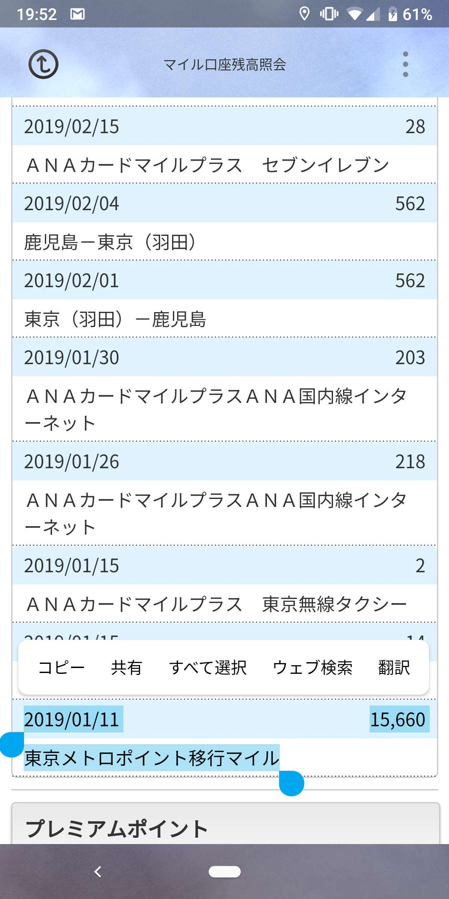
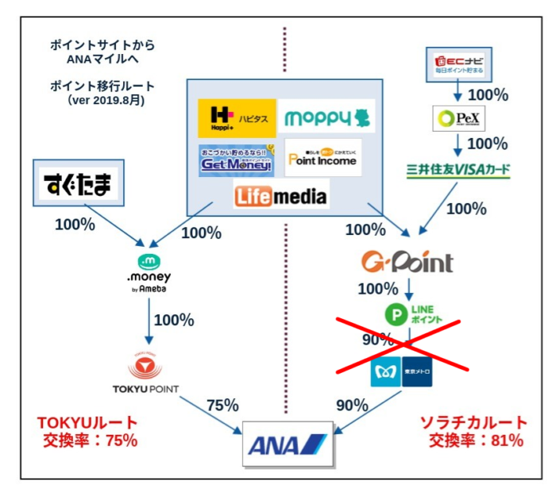
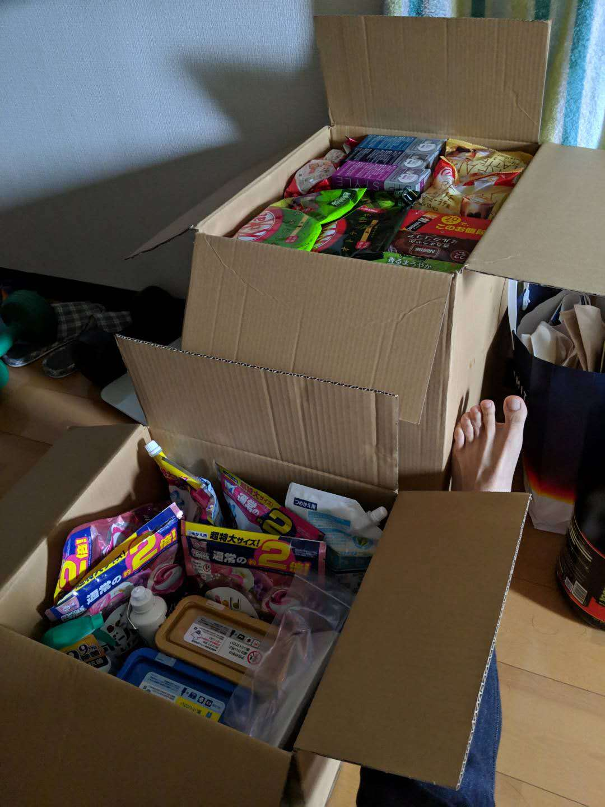

# 什么是里程
里程最早只是一种航空单位， 
进而演变成的一种积分系统。 

每次坐飞机的时候， 
航空公司都会根据飞行距离和机票类型来赋予对应的里程。 
下面可以查看不同线路的里程数  
[里程计算器](https://cam.ana.co.jp/amcmember/ppsja)

莘哥2018年末就飞了一趟南非，往返7000里程 
单程飞行时间15h, 

# 里程怎么用
里程的作用大概有以下几种
* 换机票
  * 下一章节详细说明 
* 换成sky coin 当货币使用
  * 基本 1里程 = 1 sky coin
  * 根据会员等级和交换数量最高可达到1.7倍
  * [点击查看交换比率](https://www.ana.co.jp/ja/jp/amc/reference/tukau/skycoin/#miles)
* 直接交换商品

一开始里程只能用来换机票， 
但是很多用户的里程数并没有达到能换机票的数量， 
另一方面一些商务人生积累了大量的里程但没时间换机票旅游， 
导致大量的里程堆积，用户表示不满， 
于是ANA陆续推出了其它消费里程的方式  

2019年末更新:  
今年换了5张里程票,  
1张黄金周回国往返，2张年底回国往返，2张鹿儿岛单程,  
假期的票价高涨，是使用里程票的好机会，一般都能做到1里程抵3日元以上  
另一种比较好的用法是各路lcc航空经常有促销， 
促销的套路很多都是去程便宜返程贵，这时候就可以只定去程的打折lcc票返程用里程换， 
比如这次鹿儿岛就是抢了3000日元的lcc票返程用里程整，省下来的钱可以花在吃喝上  

另外工作自由度比较高的同学可以看一下[トクたびマイル](https://www.ana.co.jp/ja/jp/amc/promo/wa_k/)  
时间上会比较紧凑，但是能用很少的里程交换到很合适的机票  
一般会是一些冷门的地方或是淡季，  
不过周末来一场说走就走的旅行，  
去一个完全没去过的陌生地也是挺好的  

## 里程兑换的机票
里程兑换成其他物品的价值往往要远小于兑换机票, 
比如用里程兑换头等舱往返票  
需要的里程数为18万  
直接购买需要100万以上的日币  
所以1里程能当5日元使用  
而其他消费里程的方式基本1里程只能有1.几日元  
所以推荐积累着里程换机票  

需要的里程数根据飞行跨度和忙季闲季而不同  
总结了一下东京出发飞各个地区需要的里程  
(每年会更新，以官网为准)  
以东京出发为基准，那些日子是淡季忙季请查看官网  

| 区分 | 目的地 |  代表地  | 经济舱 | 商务舱 | 头等舱 |
| ---- |:------:|:--------:|:------:|:------:|:------:|
| 闲季 | zone1  | 沖縄     | 14000  |        |        |
| 普通 | zone1  | 沖縄     | 18000  |        |        |
| 忙季 | zone1  | 沖縄     | 21000  |        |        |
| 闲季 | zone2  | 韩国     | 12000  | 25000  |        |
| 普通 | zone2  | 韩国     | 15000  | 30000  |        |
| 忙季 | zone2  | 韩国     | 18000  | 33000  |        |
| 闲季 | zone3  | 中国国内 | 17000  | 35000  |        |
| 普通 | zone3  | 中国国内 | 20000  | 40000  |        |
| 忙季 | zone3  | 中国国内 | 23000  | 43000  |        |
| 闲季 | zone4  | 东南亚   | 30000  | 55000  | 105000 |
| 普通 | zone4  | 东南亚   | 35000  | 60000  | 105000 |
| 忙季 | zone4  | 东南亚   | 38000  | 63000  | 114000 |
| 闲季 | zone5  | 夏威夷   | 35000  | 60000  | 120000 |
| 普通 | zone5  | 夏威夷   | 40000  | 65000  | 120000 |
| 忙季 | zone5  | 夏威夷   | 43000  | 68000  | 129000 |
| 闲季 | zone6  | 北美     | 40000  | 75000  | 150000 |
| 普通 | zone6  | 北美     | 50000  | 85000  | 150000 |
| 忙季 | zone6  | 北美     | 55000  | 90000  | 165000 |
| 闲季 | zone7  | 欧洲     | 45000  | 80000  | 165000 |
| 普通 | zone7  | 欧洲     | 55000  | 90000  | 165000 |
| 忙季 | zone7  | 欧洲     | 60000  | 95000  | 180000 |
| 闲季 | zone10 | 澳洲     | 37000  | 65000  |        |
| 普通 | zone10 | 澳洲     | 45000  | 75000  |        |
| 忙季 | zone10 | 澳洲     | 50000  | 80000  |        |

[日本国内机票交换里程数](https://www.ana.co.jp/ja/jp/amc/reference/tukau/award/dom/terms.html)
[海外机票需要里程数](https://www.ana.co.jp/ja/jp/amc/reference/tukau/award/int/usage.html)

需要注意的事
* 里程也有消费日期
* 里程购买的机票也能赠予他人,只是需要额外交一笔赠予税
* 每次航班里程购买的机票是有限的，且会更具ANA会员等级有不同的优先顺序
* 虽然机票免费，但是机场的使用费用，各种税费也还是需要交的

# 不坐飞机也能积累里程的方法
许多小伙伴并没有在高大上的跨国公司工作,  
可以频繁的全世界飞,  
而信用卡积分的里程返点率一般也就1%,  
那就没有什么更好的积累里程的方法了嘛？  

下面是莘哥1月份换到的里程  

15000，足够回国一趟了，  
如果用其他方法，要么往返2次南非(60小时飞行)  
要么ana金卡(年费1.5万)消费150万日元  

下面就给大家介绍一下里程炼金大法  
需要的有:
* AMC会员登陆
* ソラチカカード申请
* 积分网站注册

## AMC: ana mileage club
简单来说就是ana的会员系统，  
注册登陆了才能管理和使用里程  
[点击注册ana会员](https://www.ana.co.jp/amc/reference/anacard/mgm/regist/)  
填写下面的介绍人信息可以获得500里程  
紹介番号	00051167  
カナ氏名	チヨウ　イシン  

另外现在还有办卡送里程的活动,  
可以获得17000里程  
[2019 ana card活动](https://www.ana.co.jp/ja/jp/amc/reference/anacard/cpn/)

## 积分网站
简单来说就是互联网广告的一种, 
通过完成指定的任务来获得积分， 
而积分又可以用来换成其它的积分  
推荐这家积分网站
[点击注册](https://pointi.jp/p/?a=rbf880550022)

## ソラチカカード
p.s. 2019年12月后line point无法换取メトロpoint了，所以没有刚需的朋友推荐tokyo card
本身是東京メトロ推出的用来对抗JR积分系统的信用卡,  
根据メトロ的乘车距离给予对应的point,  
重点是通过这张卡可以把メトロpoint交换成ana 里程,  
而且交换比例好的惊人,  
100 point可以换 90里程  
[点击查看详细办卡](https://pointi.jp/contents/ad_intro_bonus/detail.php?c=%2F7qHprWcUVYxERri1twIQjEMthJJItRZorDuhjdfGT0%3D&s=kiKSriDi7xM%3D)

2019年底更新 
一年大概通过ソラチカ换了9万里程，可惜明年无法继续了 

## ANA TOKYU POINT ClubQ PASMO
随着Line将在2020年取消メトロpoint的交换, 
原先的通过ソラチカカード换里程的方法也不再能继续了 
而代替原先ソラチカカード的是东急POINT ClubQ PASMO 
卡的申请链接[在这](https://www.smbc-card.com/nyukai/affiliate/anatopclubq/index.jsp) 

如何通过各种积分网站换里程参考下面的图

## 总结:撸里程的流畅
(1)积分网站完成广告任务拿到站内积分  
主要是point income,注册太多管理起来麻烦,  
对比过几家基本上给的point查不了太多，  
但是point income的活动会比较多  

(2)通过不同渠道换成メトロpoint  
莘哥是这么操作的  
point income 换成 pex的积分  
pex 积分换成 LINEポイン  
每月15号前  LINEポイント 换成 metro point  
第二月11号  metro point反映  
第二月15号  metro point 交换 ANAマイル  
第三月5号  ANAマイル反映  

虽然看起来挺麻烦的， 
周期有点长,  
习惯后就好了,  
而且每月一张免费机票,  
稍微麻烦点也是值得的。 

metro point交换的每月上限是20000 point  
所以最多一年能撸18000 x 12 = 216000里程  
能飞一个纽约的头等舱了,  
头等舱可是能换睡衣躺着睡觉的呢!  
不奢侈的话也能飞几次夏威夷,  
一年2次长假的机票就免费了。 

不过不推荐花过多的时间在积分网站上,  
毕竟在职业上的投资回报率要远远高于这些小惠小利,  
周末闲的时候花一个小时看看网站， 
有合适的活动做一做就行。 

# 推荐的一些商品
## 雀巢咖啡定期便(2018旧版)
[点击查看详细](https://pointi.jp/contents/ad_intro_bonus/detail.php?c=%2F7qHprWcUVYxERri1twIQjEMthJJItRZorDuhjdfGT0%3D&s=lo1J6vX%2Bjm0%3D) 
强烈推荐的活动， 
第一次购买的物品第二次续订的才需要付费  
第二次需要购买8000, 第三次4000, 第四次4000  
总共付费24000，获得的积分也是价值24000,  
所以约等于免费得到了价值7万+的商品  
或者花24000得到了7万+的商品和一张回国往返票  
由于第二次续订的商品才需要付钱， 
所以推荐第一次下单把所有商品都加入购物车  
等第一单送到后把多余的商品取消即可,  
下面是莘哥收到的商品， 

包括以下物品:
* 大概够喝1年的350+杯咖啡(不够?同学一把年纪了克制一下好不好)
* 一年份的各种洗衣剂漂白液(单身狗一周洗2次衣服)
* 空气清新剂和洗洁精(不做饭的人洗洁精可能用不完了)
* 4大包3000 g的麦片(够4个月了吧？)
* 洗发液护发素套装(短发男生估计要用半年以上)
* 保健药品

不需要的物品可以在二手平台交易  
总之买不了吃亏，买不了上当  

这里可以申请咖啡机  
[点击查看详细](https://pointi.jp/contents/ad_intro_bonus/detail.php?c=%2F7qHprWcUVYxERri1twIQjEMthJJItRZorDuhjdfGT0%3D&s=nk5hD%2BuriHk%3D)

## 雀巢咖啡定期便(2019年末)
[雀巢薅羊毛攻略](https://github.com/cheungYX/algorithm/blob/master/cheung/pint.md)

## 信用卡类
不推荐办太多的信用卡， 
一方面卡多不好管理，  
一方面积分太分散不容易交换,  

信用卡会影响信用额度，  
所以除了真的需要不推荐办太多，  
推荐的卡有以下几张
* ANA wild gold
  * 经常旅游坐飞机的朋友推荐
* ソラチカカード
  * 本攻略必须品 
* 楽天カード
  * 虽然网站丑都是但是积分还原率高 

目前莘哥的主卡是JCB， 
日本国内基本JCB覆盖还是不错的，  
附带保险和服务在日本国内都很好用， 
主要是为了之后的高级卡The class而积累信用  
副卡打算SFC visa,  
海外旅行和积累里程用  

欢迎大家多多交流，多多转发  
有机会一起旅行  

[游记](../menu.md)  
[点击查看ANA里程攻略](https://github.com/cheungYX/algorithm/blob/master/cheung/ana.md)  
[东京购房攻略](https://github.com/cheungYX/algorithm/blob/master/cheung/ff.md)  
[东京购房攻略2⃣️](https://github.com/cheungYX/algorithm/blob/master/cheung/ff2.md)  
[保险攻略](https://github.com/cheungYX/algorithm/blob/master/cheung/hokken.md)  
[职业规划篇](https://github.com/cheungYX/algorithm/blob/master/cheung/work_root.md)  
[碳水循环减脂攻略](https://github.com/cheungYX/algorithm/blob/master/cheung/wmf.md) 
[aws初级构架师总结](https://github.com/cheungYX/algorithm/blob/master/cheung/aws.md) 