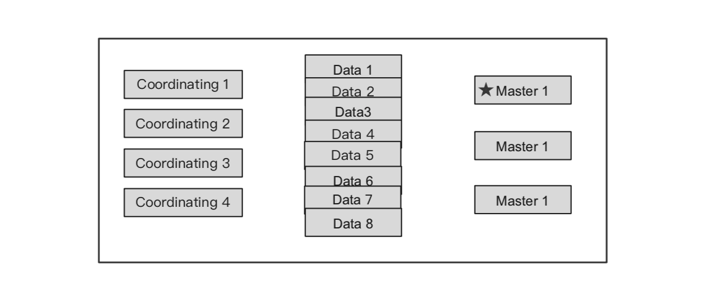
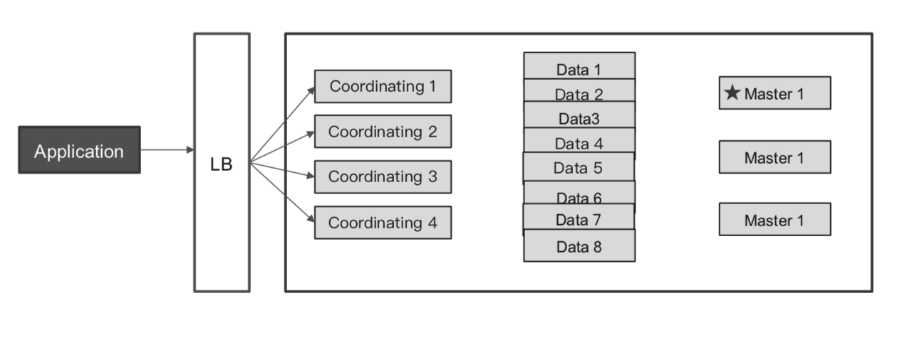
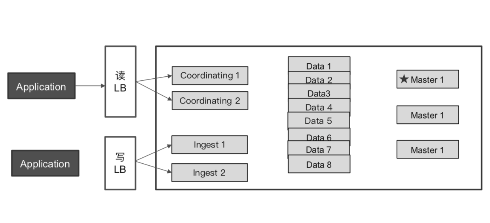
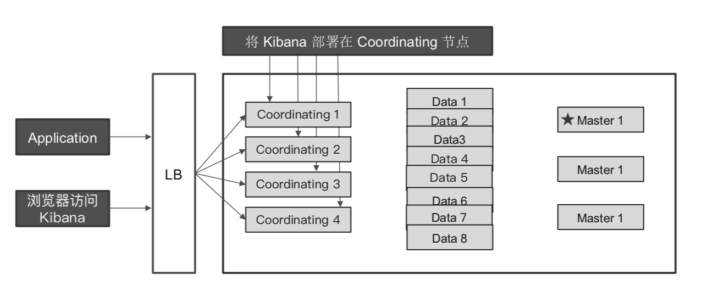
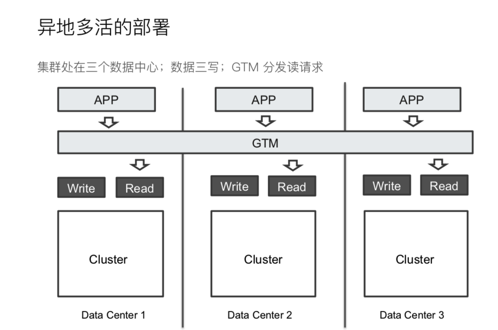

# Elasticsearch 核心技术与实战
# 0.0 概述
* Lucene base
* 高可用 & 水平扩展
* Hot & Warm构架
* RESTful API
* JDBC & ODBC
* 海量数据的分布式存储及集群管理
  - 服务与数据的高可用，水平扩展
* 近实时搜索，性能卓越
  - 结构化/全文/地理位置/自动完成
* 海量数据的近实时分析
  - 聚合功能 
* Elastic Stack 生态圈
  - 可视化   kibana
  - 存储计算 Elasticsearch
  - 数据抓取 Logstash Beat
  - 商业包   X-Pack(安全,告警,监控,机械学习)
  - 云服务 https://www.elastic.co/guide/en/cloud-on-k8s/current/index.html
* [Elasticsearch Certification](https://training.elastic.co/exam/elastic-certified-engineer)
* 分开源版本和Basic版本
  - 部分X-Pack功能支持免费使用
* Elasticsearch与数据库的集成
  - APP => 数据库 (同步机制)=> Elasticsearch
* 指标分析/日志分析
  - beats => redis/kafka/RabbitMQ => logstash => Elasticsearch => kibana/Grafana 


# 0.1 安装
* Elasticsearch
```
//启动单节点
bin/elasticsearch -E node.name=node0 -E cluster.name=geektime -E path.data=node0_data
//安装插件
bin/elasticsearch-plugin install analysis-icu

//查看插件
bin/elasticsearch-plugin list
//查看安装的插件
GET http://localhost:9200/_cat/plugins?v

//start multi-nodes Cluster
bin/elasticsearch -E node.name=node0 -E cluster.name=geektime -E path.data=node0_data
bin/elasticsearch -E node.name=node1 -E cluster.name=geektime -E path.data=node1_data
bin/elasticsearch -E node.name=node2 -E cluster.name=geektime -E path.data=node2_data
bin/elasticsearch -E node.name=node3 -E cluster.name=geektime -E path.data=node3_data

ps | grep elasticsearch
kill pid
```
jvm.options

* kibana
```
// 启动 kibana
bin/kibana

// 查看插件
bin/kibana-plugin list
```
* logstash


# 1.0 基本概念
## 1.1 索引，文档和 REST API
* 索引/类型/文档(index/type/id)
* 索引
  - 索引是文档的容器,是一类文档的结合
  - index体现了逻辑空间的概念,每个索引都有自己的Mapping定义
  - Shard体现了物理空间的概念,索引数据分散在shard上
  - Mapping用于定义包含文档的字段名和字段类型
  - Setting定义不同的数据分布
  - Type已被废除
* 文档
  - 文档是所有可搜索数据的最小单位
  - 文档会被序列化成json格式, json对象由字段组成，对应字段类型
  - 每一个文档都有一个Unique ID
  - 文档的元数据

## 1.2 节点，集群分片和副本
* 节点
  - 本质上是一个JAVA进程
  - 生产环境一般建议只运行一个实例
  - 每一个节点都有名字 -E node.name=node1
  - 每一个节点启动之后,会分配一个UID,保存在data目录下
  - Master Node & Master-eligible nodes
    - 每一个节点启动后默认是Master-eligible
    - Master-eligible节点可以参加选主流程，成为Master节点
    - 每个节点上都保存了集群的状态，只有Master节点才能修改
    - Cluster State: 节点信息,Mapping Setting,分片路由
  - Data Node & Coordinating Node
    - Data Node:保存分片数据的节点，在数据扩展上起到了关键作用
    - Coordinating Node: 接受Client请求后分发到合适的节点,最终把结果汇到一起
    - 每个节点默认都起到了Coordinating Node的职责
  - 其它节点类型
    - Hot & Warm Node: 不同磁盘硬件配置的Data Note,降低集群部署的成本
    - Machine Leaning Node
    - Tribe Node， 5.3开始使用Cross Cluster Search
* 分片
  - Primary Shard(主分片)
    - 解决水平扩展问题,通过主分片,可以将数据分布到集群内的所有节点上
    - 主分片数在index创建时指定,后续不允许修改,除非reindex
    - 过小导致后续无法增加节点实现水平扩展，单分片数据量过大导致数据分配耗时
    - 过大影响搜索结果的相关性打分,资源浪费
    - 单个存储30G内来计算需要的分片数
  - Replica Shard(副本)
    - 可动态调整
    - 通过增加副本，一定程度上提高服务的可用性(读取的吞吐)

## 1.3 文档的curd
| Index  | ```PUT my_index/_doc/1 {"user":"mike", "comment":"You Konw ..."}```     | 
| ------ |  :--------------------------------------------------------------------  |
| Create | ```POST my_index/_doc  {"user":"mike", "comment":"You Konw ..."}```     |
| Read   | ```Get my_index/_doc/1```                                               |   
| Update | ```Post my_index/_update/1 {"user":"mike", "comment":"You Konw ..."}``` |
| Delete | ```Delete my_index/_doc/1```                                            |

* index: 不存在就索引新文档，存在就更新
* Bulk
  ```
  POST _bulk
  { "index" : { "_index" : "test", "_id" : "1" } }
  { "field1" : "value1" }
  { "delete" : { "_index" : "test", "_id" : "2" } }
  { "create" : { "_index" : "test2", "_id" : "3" } }
  { "field1" : "value3" }
  { "update" : {"_id" : "1", "_index" : "test"} }
  { "doc" : {"field2" : "value2"} }
  ```
* mget
  ```
  GET /_mget
  {
      "docs" : [
          {
              "_index" : "test",
              "_id" : "1"
          },
          {
              "_index" : "test",
              "_id" : "2"
          }
      ]
  }
  ```
* msearch
  ```
  POST kibana_sample_data_ecommerce/_msearch
  {}
  {"query" : {"match_all" : {}},"size":1}
  {"index" : "kibana_sample_data_flights"}
  {"query" : {"match_all" : {}},"size":2}
  ```
## 1.4 倒排索引
* 单词词典(Tern Dictionary)
  - 记录单词与倒排列表的关系
  - B+ or 哈希来实现
* 倒排列表(Posting List)
  - 文档ID
  - 词频TF
  - 位置(Position): 文档中的分词位置,用于语句搜索(phrase query)
  - 偏移(offset): 高亮显示

## 1.5 Analyzer进行分词
* 把全文本转换成一系列单词(Term/token)的过程
* CharacterFilters(原始文本处理) => Tokenizer(按规则切分单词) => TokenFilters(单词加工,小写同意词等)
* Simple Analyzer
  – 按照非字母切分（符号被过滤），小写处理
* Stop Analyzer
  – 小写处理，停用词过滤（the，a，is）
* Whitespace Analyzer
  – 按照空格切分，不转小写
* Keyword Analyzer 
  – 不分词，直接将输入当作输出
* icu_analyzer(亚洲文字)
* 中文分词
  - IKAnalyzer
  - 
* Language
  – 提供了30多种常见语言的分词器 
```
Get /_analyze
curl -XGET 'localhost:9200/_analyze?analyzer=jp_search_analyzer' -d '5ヶ月'
```

# 2.0 Search API
* 指定索引
  ```
  /_search 集群上所以索引
  /index1/_search
  /index1,index2/_search
  /index*/_search
  ```
* Response
  - took: 整个搜索请求耗费了多少毫秒
  - total: 符合条件的总文档数
  - hits: 结果集，默认为前10个文档
  - "_index, _id, _score, _souce"
## 2.1 URI Search
```
curl -XGET "localhost:9200/index/_search?q=field1:hoge&profile=true
```
* 泛查询，正对_all,所有字段
  - GET /index/_search?q=2012 
* 指定字段
  - GET /index/_search?q=title:2012&sort=year:desc&from=0&size=10&timeout=1s 
* Term v.s Phrase
  - Term: GET /movies/_search?q=title:Beautiful Mind => Beautiful OR Mind
  - Phrase: GET /movies/_search?q=title:"Beautiful Mind" => Beautiful AND Mind
* 分组，Bool查询
  - GET /movies/_search?q=title:(Beautiful Mind)
* Bool
  - AND / OR / NOT && / || / ！
  - + must
  - - must_not
  - title:(+matrix -reloaded)
* Range []闭区间, {}开区间
  - year:{2019 TO 2018}
  - year:[* TO 2018]
* 算数符号
  - year:>2010
  - year:(>2010 && <=2018)
  - year:(+>2010 +<=2018)
* 通配符查询
  - title:be*
* 正则表达
  - title:[bt]oy 
* 模糊匹配与近似查询
  - ```title:befutifl~1```
  - ```title:"lord rings"~2```
* [文档](https://www.elastic.co/guide/en/elasticsearch/reference/7.0/search-uri-request.html)


## 2.2 Request Body & Query DSL
* match 分词查询
* tern 不分词精确匹配
  - term主要用于精确匹配哪些值，比如数字，日期，布尔值或 not_analyzed 的字符串
* paging
  ```
  curl -XGET "localhost:9200/index/_search" -H 'Content-Type: application/json' -d'
  {
    "from": 10,
    "size": 30,
    "query": {
      "match_all": {}
    }
  }'
  ```
* sort
  ```
  POST kibana_sample_data_ecommerce/_search
  {
    "sort":[{"order_date":"desc"}],
    "query":{
      "match_all": {}
    }
  }
  ```
* range
  - gt :: 大于
  - gte:: 大于等于
  - lt :: 小于
  - lte:: 小于等于
  ```
  GET books/_search
  {
    "_source": ["title", "publish_time"],
    "query": {
      "range": {
        "publish_time": {
          "gte": "2016-1-1",
          "lte": "2016-12-31",
          "format": "yyyy-MM-dd"
        }
      }
    }
  }
  ```
* source filtering
  ```
  POST kibana_sample_data_ecommerce/_search
  {
    "_source":["order_date"],
    "query":{
      "match_all": {}
    }
  }
  ```
* 脚本字段
  ```
  GET kibana_sample_data_ecommerce/_search
  {
    "script_fields": {
      "new_field": {
        "script": {
          "lang": "painless",
          "source": "doc['order_date'].value+'hello'"
        }
      }
    },
    "query": {
      "match_all": {}
    }
  }
  ```
* match
  ```
  POST movies/_search
  {
    "query": {
      "match": {
        "title": {
          "query": "last christmas",
          "operator": "and"
        }
      }
    }
  }
  ```
* match_phrase 自带了 operator 属性的值为 and 的 match
  ```
  POST movies/_search
  {
    "query": {
      "match_phrase": {
        "title":{
          "query": "one love",
          "slop": 1
  
        }
      }
    }
  }
  ```
* perfix
  ```
  GET books/_search
  {
    "_source": "description", 
    "query": {
      "prefix": {
        "description": "wi"
      }
    }
  }
  ```
* [文档](https://www.elastic.co/guide/en/elasticsearch/reference/7.0/search-request-body.html)

## 2.3 Query String & Simple Query String
* Query string
  ```
  POST users/_search
  {
    "query": {
      "query_string": {
        "default_field": "name",
        "query": "Ruan AND Yiming"
      }
    }
  }
  ```
* Simple Query String
  - 类似Query String但是会忽略错误语法
  - 不支持AND OR NOT
  - Term之间默认的关系是OR，可以指定Operator
  - + 替代 AND, | 替代 OR, - 替代 NOT
  ```
  POST users/_search
  {
    "query": {
      "simple_query_string": {
        "query": "Ruan Yiming",
        "fields": ["name"],
        "default_operator": "AND"
      }
    }
  }
  ```

# 3.0 Mapping
* 预定义字段的类型以及相关属性 solr schema
  ```
  {
      "mappings": {
          "my_type": {
          //true:表示自动识别新字段并创建索引，false:不自动索引新字段，strict:遇到未知字段，抛异常，不能存入
              "dynamic":      "strict", 
              
                //动态模板
               "dynamic_templates": [
                      { "stash_template": {
                        "path_match":  "stash.*",
                        "mapping": {
                          "type":           "string",
                          "index":       "not_analyzed"
                        }
                      }}
                    ],
              //属性列表
              "properties": {
                  //一个strign类型的字段
                  "title":  { "type": "string"},
                  
                  "stash":  {
                      "type":     "object",
                      "dynamic":  true 
                  }
              }
          }
      }
  }
  ```
* 类型
  - String 
  - text, keyword
  - long, integer, short, byte, double, float
  - date
  - boolean
  - binary
  - object, nested
  - geo-point, geo-sharp
  - ip, competion
* 属性
  - index_name 
  - anylyzer
  - store 显示存储
  - boost
  - null_value
  - include_in_all
  - format
  ```
  {
      "mappings": {
          "my_type": {
          //true:表示自动识别新字段并创建索引，false:不自动索引新字段，strict:遇到未知字段，抛异常，不能存入
              "dynamic":      "strict", 
              
                //动态模板
               "dynamic_templates": [
                      { "stash_template": {
                        "path_match":  "stash.*",
                        "mapping": {
                          "type":           "string",
                          "index":       "not_analyzed"
                        }
                      }}
                    ],
              //属性列表
              "properties": {
                  //一个strign类型的字段
                  "title":  { "type": "string"},
                  
                  "stash":  {
                      "type":     "object",
                      "dynamic":  true 
                  }
              }
          }
      }
  }
  ```

## 3.1 Dynamic Mapping
* 在写入文档的时候,如果索引不存在会自动创建索引
* 无需手动定义Mapping,Elasticsearch会自动根据文档信,推算出字段的类型
* 但是有时候会推算的不准确,例如地理位置信息
* 当类型如果设置不对时,会导致一些功能无法正常运行,例如Range查询
* 后期修改Mapping的字段类型
  - 新增字段
    - Dynamic: true,  一旦有新增字段的文档写入,Mapping也同时被更新
    - Dynamic: false, Mapping不会被更新,新增字段的数据无法被索引,但是信息会出现在_source中
    - Dynamic: Strict, 文档写入失败
  - 对已有字段,一旦已有数据写入,就不再支持修改字段定义

## 3.2 显式Mapping
* 推荐步骤
  - 创建一个临时的index,写入一些样本数据
  - 通过访问Mapping API 获得该文件的动态Mapping定义
  - 修改后使用该配置创建你的索引
  - 删除临时索引
* null_value
  - 只要keyword类型支持设定null_value
  ```
  PUT users
  {
      "mappings" : {
        "properties" : {
          "firstName" : {
            "type" : "text"
          },
          "lastName" : {
            "type" : "text"
          },
          "mobile" : {
            "type" : "keyword",
            "null_value": "NULL"
          }
  
        }
      }
  }
  ```
* _all在7中被copy_to所替代
* es中不提供专门的数组类型,但是任何字段,都可以包含多个相同类型的数值

## 3.3 多字段特性
* 实现精确匹配
  - 增加一个keyword字段
* 使用不同的analyzer
  - 不同语言
  - pinyin 字段的搜索
  - 还支持为搜索和索引指定不同的analyzer
* Exact Values(精确值) vs Full Text
  - Exact Values: keyword
  - Full Text: text
* 自定义分词
  - Character Filter
    - 增加及替换字符
    - 可配置多个Character Filter
    - 会影响Tokenizer的position和offset信息
    - 自带: HTML strip, Mapping, Pattern replace
  - Tokenizer
    - 切词
    - 可用java开发插件实现自己的Tokenizer
  - Token Filter
    - 将Tokenizer输出的词(term)进行增删该
  ```
  "jp_search_analyzer" : {
      "type" : "custom",
      "tokenizer" : "kuromoji_user_dict",
      "filter": [ "jp_search_stop_filter", "synonym_series_filter", "jp_synonym_filter", "jp_synonym_search_filter" ],
      "char_filter": ["jp_mapping", "jp_mapping2", "number_norm"]
  },
  "jp_index_analyzer" : {
      "type" : "custom",
      "tokenizer" : "kuromoji_user_dict",
      "filter": [ "jp_search_stop_filter", "synonym_series_filter", "jp_synonym_filter" ],
      "char_filter": ["jp_mapping", "jp_mapping2", "number_norm", "url_filter", "user_filter"]
  },
  ```

## 3.4 Index Template和 Dynamic Template
* Index Template
  - 帮助你设定Mappings和Settings并按照一定的规则自动匹配到新创建的索引之上
  - 模版仅在一个索引被新创建时,才会产生作用，修改模版不会影响已创建的索引
  - 可以设定多个索引模版,这些设置会被merge在一起
  - 可以指定order的数值,控制merging的过程
  ```
  PUT /_template/template_test
  {
      "index_patterns" : ["test*"],
      "order" : 1,
      "settings" : {
        "number_of_shards": 1,
          "number_of_replicas" : 2
      },
      "mappings" : {
        "date_detection": false,
        "numeric_detection": true
      }
  }
  ```
* Index Template工作方式
  - 应用Elasticsearch默认的setting和mapping
  - 应用order数值低的Index Template中的设定
  - 应用order数值高的Index Template中的设定
  - 应用创建索引时,用户所指定的settings和mappings,并覆盖之前模版中的设定
* Dynamic Template
  - 根据Elasticsearch识别的数据类型,结合字段名称,来动态设定字段类型
  - 所有的字符串类型都设定成keyword,或者关闭keyword字段
  - is开头的字段都设置成boolean
  - long_开头的都设置成long类型
  ```
  {
    "mappings": {
      "dynamic_templates": [
              {
          "strings_as_boolean": {
            "match_mapping_type":   "string",
            "match":"is*",
            "mapping": {
              "type": "boolean"
            }
          }
        },
        {
          "strings_as_keywords": {
            "match_mapping_type":   "string",
            "mapping": {
              "type": "keyword"
            }
          }
        }
      ]
    }
  }
  ```
* [Index Template文档](https://www.elastic.co/guide/en/elasticsearch/reference/7.1/indices-templates.html)
* [Dynamic Template文档](https://www.elastic.co/guide/en/elasticsearch/reference/7.1/dynamic-mapping.html)

## 3.5 聚合分析(Aggregation)
* 通过聚合,可以得到一个数据的概览
* 高性能,只需要一条语句就能从Elasticsearch得到分析结果,无需在客户端实现
* Bucket Aggregation
  - 一些满足特定条件的文档的集合
  - Term & Range
* Metric Aggregation
  - 一些数学运算，可以多文档字段进行统计分析
  - 同样也支持在脚本(painless script)产生的结果之上进行计算
  - 大多数metric是数学计算,仅输出一个值 min / max / sum / avg / cardinality
  - 部分metric支持输出多个数值 stats / percentiles / percentiles_ranks
* Pipeline Aggregation
  - 对其它的聚合结果进行二次聚合
* Matrix Aggregation
  - 支持对多个字段的操作并提供一个结果矩阵
  ```
  {
    "size": 0,
    "aggs":{
      "flight_dest":{
        "terms":{
          "field":"DestCountry"
        },
        "aggs":{
          "avg_price":{
            "avg":{
              "field":"AvgTicketPrice"
            }
          },
          "max_price":{
            "max":{
              "field":"AvgTicketPrice"
            }
          },
          "min_price":{
            "min":{
              "field":"AvgTicketPrice"
            }
          }
        }
      }
    }
  }
  ```
* [search-aggregations文档](https://www.elastic.co/guide/en/elasticsearch/reference/7.1/search-aggregations.html)

# 4.0 搜索与分词
## 4.1 Term与Full Text
* Keyword vs Text
* Term
  - 表达语意的最小单位
  - Term Query / Range Query / Exists Query / Prefix Query / Wildcard Query
  - 对输入不会做分词,会将输入作为一个整体,在倒排索引中查找准确的词项,并进行相关度算分
  - 可以通过 Constant score将查询换成一个Filtering,避免算分,并利用缓存,提高性能
  ```
  POST /products/_search
  {
    //"explain": true,
    "query": {
      "term": {
        "productID.keyword": {
          "value": "XHDK-A-1293-#fJ3"
        }
      }
    }
  }
  
  POST /products/_search
  {
    "explain": true,
    "query": {
      "constant_score": {
        "filter": {
          "term": {
            "productID.keyword": "XHDK-A-1293-#fJ3"
          }
        }
  
      }
    }
  }
  ```
* Full Text
  - Match Query / Match Phrase Query / Query String Query
  - 索引和搜索时都会进行分词
  - 查询会对每个词项逐个进行底层的查询,在将结果进行合并,并为每一个文档生成一个算分
  - Precision & Recall

## 4.2 结构化搜索(Structured search)
* 指对于结构化数据的搜索
  - 日期,bool和数字都是结构化的
  - 文本也可以是结构化的
  - 对于有精准的格式的结构化数据,我们可以进行逻辑操作,包括比较范围或判定大小
    - gt 大于
    - lt 小于
    - gte 大于等于
    - lte 小于等于
  - 结构化的文本可以做精确匹配或部分匹配, Term / Prifix
  - 结构化结果只有是或否两个值
  - 处理多值字段，term 查询是包含，而不是等于
  ```
  #数字类型 Term
  POST products/_search
  {
    "profile": "true",
    "explain": true,
    "query": {
      "term": {
        "price": 30
      }
    }
  }
  
  #数字类型 terms
  POST products/_search
  {
    "query": {
      "constant_score": {
        "filter": {
          "terms": {
            "price": [
              "20",
              "30"
            ]
          }
        }
      }
    }
  }
  
  #数字 Range 查询
  GET products/_search
  {
      "query" : {
          "constant_score" : {
              "filter" : {
                  "range" : {
                      "price" : {
                          "gte" : 20,
                          "lte"  : 30
                      }
                  }
              }
          }
      }
  }
  
  # 日期 range
  POST products/_search
  {
      "query" : {
          "constant_score" : {
              "filter" : {
                  "range" : {
                      "date" : {
                        "gte" : "now-1y"
                      }
                  }
              }
          }
      }
  }
  #exists查询
  POST products/_search
  {
    "query": {
      "constant_score": {
        "filter": {
          "exists": {
            "field": "date"
          }
        }
      }
    }
  }
  ```

## 4.3 搜索的相关性算分
* 相关性 Relevance
  - TF-IDF, BM 25
* 词频 Term Frequency
* 逆文档频率 IDF
* score(q,d) = coord(q,d) * queryNorm(q) * E(tf(t in d)) * idf(t)2 * boost(t) * norm(t,d))
* BM 25
  - 和TF-IDF相比,当TF无限增加时,BM 25算分会趋于一个数值
* explain API
  - "explain": true
* Boosting Relevance

## 4.4 Query & Filtering与多字符串多字段查询
* bool查询
  - 一个或多个查询字句的组合
  - must 必须匹配,贡献算分
  - should 选择性匹配,贡献算分
  - must_not Filter Context,查询字句,必须不能匹配
  - filter Filter Context,必须匹配,但是不贡献算分
  - 同一层级下的竞争字段具有相同的权重
  - 通过嵌套bool查询可以改变对算分的影响
```
{
  "query": {
    "bool" : {
      "must" : {
        "term" : { "price" : "30" }
      },
      "filter": {
        "term" : { "avaliable" : "true" }
      },
      "must_not" : {
        "range" : {
          "price" : { "lte" : 10 }
        }
      },
      "should" : [
        { "term" : { "productID.keyword" : "JODL-X-1937-#pV7" } },
        { "term" : { "productID.keyword" : "XHDK-A-1293-#fJ3" } }
      ],
      "minimum_should_match" :1
    }
  }
}
```

## 4.5 单字符串多字段查询:Dis Max Query
* Disjunction Max Query
  - 将任何与任一查询匹配的文档作为结果返回,采用字段上最匹配的评分最终评分返回
* tie_breaker调整
  - 获得最佳匹配语句的评分_score
  - 将其它匹配语句的评分与tie_breaker调整相乘
  - 对以上评分求和并规范化
```
{
    "query": {
        "dis_max": {
            "queries": [
                { "match": { "title": "Quick pets" }},
                { "match": { "body":  "Quick pets" }}
            ],
            "tie_breaker": 0.2
        }
    }
}
```

## 4.6 Multi Match
* 最佳字段 Best Fields
  - 当字段之间相互竞争有相互关联,如title和body,评分来自最匹配字段
* 多数字段 Most Fields
  - 处理英文内容时,一种常见的手段是,在主字段抽取词干加入同义词,以匹配更多文档
  - 相同的文本加入子字段,以提供更加精确的匹配
* 混合字段 Cross Fields
  - 对于某些实体,如人名,地址,需要在多个字段中确定信息,每个字段只能作为整体的一部分,希望在任何这些列出的字段中找到尽可能多的词
```
{
  "query": {
    "multi_match": {
      "type": "best_fields",
      "query": "Quick pets",
      "fields": ["*_title","body"],
      "tie_breaker": 0.2,
      "minimum_should_match": "20%"
    }
  }
}
```

## 4.7 中文分词
* 混合语言
  - 语言识别 => 不同语言不同索引
* [Elasticsearch IK 分词插件](https://github.com/medcl/elasticsearch-analysis-ik/releases)
* [Elasticsearch hanlp 分词插件](https://github.com/KennFalcon/elasticsearch-analysis-hanlp)
* [分词算法综述](https://zhuanlan.zhihu.com/p/50444885)
* [中科院计算所](http://ictclas.nlpir.org/nlpir/)
* [ansj 分词器](https://github.com/NLPchina/ansj_seg)
* [哈工大的 LTP](https://github.com/HIT-SCIR/ltp)
* [清华大学 THULAC](https://github.com/thunlp/THULAC)
* [斯坦福分词器](https://nlp.stanford.edu/software/segmenter.shtml)
* [Hanlp 分词器](https://github.com/hankcs/HanLP)
* [结巴分词](https://github.com/yanyiwu/cppjieba)
* [KCWS 分词器 (字嵌入 +Bi-LSTM+CRF)](https://github.com/koth/kcws)
* [ZPar](https://github.com/frcchang/zpar/releases)
* [IKAnalyzer](https://github.com/wks/ik-analyzer)

## 4.8 Search template & Index Alias
* 解耦程序 & 搜索DSL
  * boost只需要更新template无需修改前端
  ```
  POST _scripts/tmdb
  {
    "script": {
      "lang": "mustache",
      "source": {
        "_source": [
          "title","overview"
        ],
        "size": 20,
        "query": {
          "multi_match": {
            "query": "{{q}}",
            "fields": ["title","overview"]
          }
        }
      }
    }
  }
  
  // 使用template查询
  POST tmdb/_search/template
  {
      "id":"tmdb",
      "params": {
          "q": "basketball with cartoon aliens"
      }
  }
  ```
* Index Alias
  ```
  curl -XPOST ’http://localhost:9200/_aliases’ -d ’{
      "actions" : [
        { "remove": {"index": "index_v1", "alias": "index" } },
        { "add" :   {"index": "index_v2", "alias": "index" } }
  ] }’
  ```  

## 4.9 Function Score Query
* 在查询结束后,对每一个文档进行一系列的重新算分,根据生成的分数进行排序
* 默认记分值函数
  - Weight: 为每一个文档设置一个简单而不被规范化的权重
  - Field Value Factor: 使用该数值来修改_score, 例如将"热度"和"点赞数"作为算分的参考因素
  - Random Score: 为每一个用户使用一个不同的,随机算分结果
  - 衰减函数: 以某个字段的值为标准,距离某个值越近,得分约高
  - Script Score: 自定义脚本完全控制所有逻辑
* modifier: log1p 平滑度处理
* Boost Mode
  - Multiply: 算分与函数值的乘积
  - Sum: 算分与函数的和
  - Min / Max: 算分与函数去 最大/最小
  - Replace: 使用函数值取代算分
* 随机函数
  - 场景: 网站的广告需要提高展现率
  - 不同用户看到不同的排名,但是同一个用户访问时结国相对一致
  - seed值一致返回结果就一致
```
POST /blogs/_search
{
  "query": {
    "function_score": {
      "query": {
        "multi_match": {
          "query":    "popularity",
          "fields": [ "title", "content" ]
        }
      },
      "field_value_factor": {
        "field": "votes",
        "modifier": "log1p" ,
        "factor": 0.1
      },
      "boost_mode": "sum",
      "max_boost": 3
    }
  }
}

POST /blogs/_search
{
  "query": {
    "function_score": {
      "random_score": {
        "seed": 911119
      }
    }
  }
}
```

## 4.10 Term & Phrase Suggest
* 搜索建议: Suggest API
* 原理: 将输入的文本分解为Token, 然后在索引的字典里查找相似的Term并返回
* Term
  - Suggestion Mode
    - Missing 索引中已经存在就不提供意见
    - Popular 推荐出现频率更高的词
    - Always 无论是否存在都提供建议
  ```
  POST /articles/_search
  {
  
    "suggest": {
      "term-suggestion": {
        "text": "lucen rock",
        "term": {
          "suggest_mode": "always",
          "field": "body",
        }
      }
    }
  }
  ```
* Phrase Suggester
  - Suggest Mode
  - Max Errors: 最多可拼错的Terms数
  - Confidence: 限制返回结果数,默认 1
  ```
  POST /articles/_search
  {
    "suggest": {
      "my-suggestion": {
        "text": "lucne and elasticsear rock hello world ",
        "phrase": {
          "field": "body",
          "max_errors":2,
          "confidence":0,
          "direct_generator":[{
            "field":"body",
            "suggest_mode":"always"
          }],
          "highlight": {
            "pre_tag": "<em>",
            "post_tag": "</em>"
          }
        }
      }
    }
  }
  ```

## 4.11 自动补全与上下文提示
* Completion Suggester
* 对性能要求比较苛刻
* 原理: 将Analyze的数据编码成FST和索引一起存放,FST会被ES加载进内存
* FST只能用于前缀查找
* 必要步骤
  - Mapping 定义type: completion
  ```
  PUT articles
  {
    "mappings": {
      "properties": {
        "title_completion":{
          "type": "completion"
        }
      }
    }
  }
  // 查询
  POST articles/_search?pretty
  {
    "size": 0,
    "suggest": {
      "article-suggester": {
        "prefix": "elk ",
        "completion": {
          "field": "title_completion"
        }
      }
    }
  }
  ```
* Context Suggester
  - completion suggester 的扩展
  - 可以在搜索中加入更多上下文信息
  - 不同的category给予不同的suggester
  ```
  PUT comments/_mapping
  {
    "properties": {
      "comment_autocomplete":{
        "type": "completion",
        "contexts":[{
          "type":"category",
          "name":"comment_category"
        }]
      }
    }
  }
  
  POST comments/_doc
  {
    "comment":"I love the star war movies",
    "comment_autocomplete":{
      "input":["star wars"],
      "contexts":{
        "comment_category":"movies"
      }
    }
  }
  
  POST comments/_doc
  {
    "comment":"Where can I find a Starbucks",
    "comment_autocomplete":{
      "input":["starbucks"],
      "contexts":{
        "comment_category":"coffee"
      }
    }
  }
  
  
  POST comments/_search
  {
    "suggest": {
      "MY_SUGGESTION": {
        "prefix": "sta",
        "completion":{
          "field":"comment_autocomplete",
          "contexts":{
            "comment_category":"coffee"
          }
        }
      }
    }
  }  
  ```
* 精准度
  - Completion > Phrase > Term
* 照会率
  - Term > Phrase > Completion
* 性能
  - Completion > Phrase > Term

# 5.0 分布式特性以及分布式搜索的机制
## 5.1 配置跨集群搜索
* 水平扩展的痛点
  - 单集群
    - 水平扩展时,节点数不能无限增加
    - 单集群的meta信息(节点,索引,集群状态)过多,会导致更新压力变大,单个Active Master会成为性能瓶颈,导致整个集群无法工作
  - 早期版本
    - 通过Tribe Node可以实现多集群访问的需求,但存在一定的问题
    - Tribe Node会以 Client Node的方式加入每个集群,集群中Master节点的任务更需要Tribe Node的回应才能继续
    - Tribe Node不保存 Cluster State信息,一旦重启,初始化很慢
    - 当多个集群存在索引重名的情况时,只能设置一种Prefer规则
* 跨集群搜索Cross Cluster Search
  - Tribe Node已被Deprecated
  - 允许任何节点扮演federated节点,以轻量方式,将搜索请求进行代理
  - 不需要以client Node的形式加入其它集群
  ```
  curl -XPUT "http://localhost:9200/_cluster/settings" -H 'Content-Type: application/json' -d'
  {"persistent":{"cluster":{"remote":{"cluster0":{"seeds":["127.0.0.1:9300"],"transport.ping_schedule":"30s"},"cluster1":{"seeds":["127.0.0.1:9301"],"transport.compress":true,"skip_unavailable":true},"cluster2":{"seeds":["127.0.0.1:9302"]}}}}}'
  
  curl -XPUT "http://localhost:9201/_cluster/settings" -H 'Content-Type: application/json' -d'
  {"persistent":{"cluster":{"remote":{"cluster0":{"seeds":["127.0.0.1:9300"],"transport.ping_schedule":"30s"},"cluster1":{"seeds":["127.0.0.1:9301"],"transport.compress":true,"skip_unavailable":true},"cluster2":{"seeds":["127.0.0.1:9302"]}}}}}'

  curl -XPUT "http://localhost:9202/_cluster/settings" -H 'Content-Type: application/json' -d'
  {"persistent":{"cluster":{"remote":{"cluster0":{"seeds":["127.0.0.1:9300"],"transport.ping_schedule":"30s"},"cluster1":{"seeds":["127.0.0.1:9301"],"transport.compress":true,"skip_unavailable":true},"cluster2":{"seeds":["127.0.0.1:9302"]}}}}}'
  ```

## 5.2 集群分布式模型
* 分布式特性
  - 存储的水平扩容,支持PB级数据
  - 高可用,部分节点停止服务,整个集群的服务不受影响
* Elasticsearch 的分布式架构
  - 不同的集群通过不同的名字来区分,默认名"elasticsearch"
  - 通过修改配置文件,或者在命令行中 -E cluster.name=hokehoke 进行设定
* 节点
  - 本质上是一个JAVA进程
  - 生产环境一般建议只运行一个实例
  - 每一个节点都有名字 -E node.name=node1
  - 每一个节点启动之后,会分配一个UID,保存在data目录下
* Coordinating Node
  - 处理请求的节点
  - 路由请求到正确的节点,例如创建索引的请求,需要路由到Master节点
  - 所有节点默认都是Coordinating Node
  - 通过将其他类型设置成False, 使其成为Dedicated Coordinating Node
* Data Node
  - 可以保存数据的节点,叫做Data Node
  - 节点启动后,默认就是数据节点,可以设置node.data:false禁止
  - 职责: 保存分片数据,在数据扩展上起到了至关重要的作用(由Master Node决定如何分片)
  - 通过增加数据节点可以解决数据水平扩展和解决数据单点问题
* Master Node
  - 职责: 处理创建,删除索引等请求.决定分片被分配到哪个节点,维护并且更新 Cluster State
  - Master节点非常重要,在部署上需要考虑解决单点问题
  - 为一个集群设置多个Master节点,每个节点只承担Master的单一角色
  - 一个集群,支持配置多个Master Eligible节点,这些节点可以在必要时参与主流程,成为Master节点
  - 每个节点启动后默认就是一个Master Eligible节点
  - 可以设置 node.master: false禁止
  - 集群内第一个Master Eligible节点启动时候,它会将自己选举成Master节点
* 集群状态
  - 集群状态信息(Cluster State)维护了一个集群中必要的信息
    - 所有节点的信息
    - 所有的索引和其相关的 Mapping与 Setting信息
    - 分片的路由信息
  - 每个节点上都保存了集群的状态信息
  - 但是只有Master节点才能修改集群的状态信息,并负责同步给其他节点
* Master Eligible Nodes 选主过程
  - 相互Ping对方,Node id 低的会成为被选举的节点
  - 其他节点会加入集群,但是不承担Master节点的角色,一旦发现被选中的主节点丢失,就会选出新的Master节点
* 脑裂问题
  - Quorum = (Master 数 / 2) + 1
  - 当3个 Master Eligible时,设置 discovery.zen.minimum_maser_nodes = 2
  - 7.0以后不需要设置

## 5.3 分片与集群的故障转移
* 分片是Elasticsearch分布式存储的基石
* 通过主分片,将数据分布在所有节点上
* 主分片在创建时指定,后续默认不能修改,如要修改需要重新创建索引
* Replica Shard: 数据可用性
  - 一旦主分片丢失, 副本分片可以Promote成主分片
  - 可以动态调整, 每个节点上都有完备的数据
  - 可以通过增加副本分片提升系统的读取性能
* 分片数设定
  - 主分片数过小: 如果索引增长很快,集群无法通过增加节点实现对这个索引的数据扩展
  - 主分片数过大: 导致单个shard容量很小,引发单个节点有过多的分片,影响性能
  - 副本分片过多: 降低集群整体的写入能力
* health API
  - Green: 健康状态, 所有主分片和副本分片都能用  
  - Yellow: 亚健康状态, 所有主分片可用, 部分副本分片不可用
  - Red: 不健康状态, 部分主分片不可用

## 5.4 文档分布式存储
* 文档会存储在具体的某个主分片和副本分片上
* 文档到分片的映射算法shard = hash(_routing) % number_of_primary_shards
  - Hash算法确保文档会均匀的分布在所用分片上,充分利用硬件资源
  - 默认的_routing值是文档id
  - 可以自行设置_routing数值
  - 这就是primary不能随便修改的原因

## 5.5 分片及其生命周期
* ES的最小工作单元是分片, 相当与Lucene的index
* 倒排索引采用Immutable design, 一旦生成不可修改
  - 无需考虑并发写文件的问题,避免锁带来的性能问题
  - 有效利用文件系统缓存
  - 缓存容易生成和维护, 数据可被压缩
  - 如果需要一个新的文档可被搜索, 需要重建整个索引
* Lucene index
  - 单个倒排索引被称为Segment, Segment是自包含不可变的
  - 多个Segment组成index, 对于ES的shard
  - 新文档写入时会生成新的Segment，查询时会查询所有Segment并对结果汇总
  - commit point记录所有Segment信息
  - 删除文档的信息保存在.del文件中
* Refresh
  - 将index buffer写入Segment的操作叫做Refresh，Refresh不执行fsync操作
  - Refresh频率默认一秒一次,可通过index.refresh_interal配置
  - Refresh后数据就可以被搜索到了
  - 系统有大量的数据写入,就会产生很多的Segment
  - index buffer被占满后时，会触发Refresh，默认是JVM的10%
* Transaction log
  - Segment 写入磁盘的过程相对耗时, 借助文件系统缓存, Refresh时先将Segment写入缓存以开放查询
  - 为了保证数据不丢失, index文档时同时写Transaction log,高版本开始Transaction log默认落盘
  - 每个分片有一个Transaction log
  - 在ES Refresh时, index buffer会被清空,Transaction log不会清空
* Flush
  - 调用Refresh, index Buffer清空并且Refresh
  - 调用fsync将缓存Segment写入磁盘
  - 清空Transaction log
  - 默认30分钟一次
  - Transaction log满也会触发(512MB)
* Merge
  - Segment文件很多需要被定期合并
  -  删除.del记录的已被删除文档
  - ES 和 luence会自动merge
  - POST my_index/forcemerge

## 5.6 剖析分布式查询及相关性算分
* ES的搜索分Query 和 Fetch 两阶段
  - 1. 节点收到请求后会以Coordinating 节点的身份发送查询请求 
  - 2. 被选中的分片执行查询, 进行排序,然后每个分片都会返回from + size 个排序后的文档id和排序值给Coordinating节点
  - 3. Coordinating Node 会将Query阶段, 从每个分片获取的排序后的文档id列表进行重新排序
  - 4. 以mulit get 请求的方式到相应的分片获取详细的文档数据
* 性能问题
  - 每个分片上需要查的文档数 = from + size
  - 最终 Coordinating Node 需要处理: number_of_shard * (from + size)
  - 深度分页
* 相关性算分
  - 每个分片都基于自己的分片上的数据进行相关度计算,因此导致算分偏离
  - 数据量不大的情况,可将主分片数设为1
  - 数据量足够大,只要保证文档均匀分散在各个分片上,结果一般不会出现偏差
  - 使用 DFS Query than Fetch,``` _search?search_type=dfs_query_than_fetch,```消耗cpu和内存,不推荐使用


## 5.7 排序及Doc Values&Fielddata
* 默认采用相关性算分对结果进行降序排序
* 可以通过设定sorting参数,自行设定排序
* 不指定_score, 算分为null
* text默认不能进行排序, fielddata=true
* ES的两种排序实现
  - Field data
  - Doc Values(列式存储, 对text无效)
* 关闭Doc Values
  - 默认启用,可通过Mapping设置关闭
  - 关闭可增加索引速度，减少磁盘空间
  - 重新打开需要重建索引
  - 明确不需要进行排序和聚合分析时推荐关闭

|          |     Doc Values            |    Field data             |
| -------- | :-------------------------| :------------------------ |
| 何时创建 | 索引时,和倒排索引一起     | 搜索时动态创建            |
| 创建位置 | 磁盘文件                  | JVM Heap                  |
| 优点     | 避免大量内存使用          | 索引速度快,不占用额外磁盘 |
| 缺点     | 降低索引速度,额外磁盘空间 | 动态开销快占用过多JVMHeap |
| 缺省值   | ES 2.x 之后               | ES 1.x 及之前             |

## 5.8 分页与遍历：From, Size, Search After & Scroll API
* 默认情况下,按照相关性算分排序,返回前10条
* 分布式系统的深度分页问题
  - From 990, size 10会在每一个分片上都先获取1000个文档然后通过 Coordinating Node 聚合所有结果再排序选取
  - 页数越深,占用内存越多,为避免过多内存开销,ES默认限定10000个文档
* Search After
  - 避免深度分页性能问题,可以实时获取下一页文档信息
  - 不支持指定页数From,只能往下翻
  - 进一步搜索需要指定sort,并保证值是唯一的(可以通过加入_id保证唯一性)
  - sort[ {"age": "desc"}, {"_id": "asc"}]
  - 然后使用上一次,最后一个文档的sort值进行查询
  - 原理: 通过唯一排序值定位,将每次要处理的文档数控制在size
  ```
  POST users/_search
  {
      "size": 1,
      "query": {
          "match_all": {}
      },
      "search_after":
          [ 
            10,
            "ZQ0vYGsBrR8X3IP75QqX"
          ],
      "sort": [
          {"age": "desc"} ,
          {"_id": "asc"}    
      ]
  }
  ```
* Scroll API
  - 创建一个快照，有新的数据写入后无法被查询到
  - 每次查询后输入上一次的 Scroll id
  ```
  POST /users/_search?scroll=5m
  {
      "size": 1,
      "query": {
          "match_all" : {
          }
      }
  }
  
  
  POST users/_doc
  {"name":"user5","age":50}
  POST /_search/scroll
  {
      "scroll" : "1m",
      "scroll_id" : "DXF1ZXJ5QW5kRmV0Y2gBAAAAAAAAAWAWbWdoQXR2d3ZUd2kzSThwVTh4bVE0QQ=="
  }
  ```
* 不同的搜索类型和使用场景
  - Regular: 需要获取顶部部分文档
  - Scroll: 需要获取全部文档，例如导出全部数据
  - Pagination: From和size，如果需要深度分页则使用search_after

## 5.9 处理并发读写操作
* ES采用乐观并非控制
  - 假设冲突不会发生
* ES的文档是不可变的
  - 如果更新一个文档，就会将该文档标记为删除
  - 同时增加一个全新的文档，文档的version字段加1
* 内部版本控制
  - if_seq_no + if_primary_term
* 外部版本控制
  - version + version_type = external

```
PUT products/_doc/1?if_seq_no=1&if_primary_term=1
{
  "title":"iphone",
  "count":100
}

PUT products/_doc/1?version=30000&version_type=external
{
  "title":"iphone",
  "count":100
}
```

# 6.0 聚合分析
## 6.1 Bucket & Metric
* Aggregation语法
  - 属于search的一部分,建议size指定为0
  - 自定义聚合名
  - 可包含多个同级的聚合查询
* Metric Aggregation
  - 单值分析: 只输出一个分析结果, min,max,avg,sum, Cardinality
  - 多值分析: 输出多个分析结果, stats, extended stats, percentile, percentile rank, top hits
* Bucket Aggregation
  - 按照一定的规则,将文档分配到不同的桶中,从而达到分类的目的
  - Terms, 数字类型的 Range / Data Range / Histogram / Data Histogram
  - 支持嵌套,在桶里再做分桶
* Terms Aggregation
  - 字段需要打开fielddata
  - keyword默认支持doc_values
  - Text需要在mapping中enable
* [Metric](https://www.elastic.co/guide/en/elasticsearch/reference/7.1/search-aggregations-metrics.html)
* [Bucket](https://www.elastic.co/guide/en/elasticsearch/reference/7.1/search-aggregations-bucket.html)

## 6.2 Pipeline
* 支持对聚合分析的结果，再次进行聚合分析
  - 结果和其他的聚合同级
  - 通过buckets_path指定路径
  ```
  POST employees/_search
  {
    "size": 0,
    "aggs": {
      "jobs": {
        "terms": {
          "field": "job.keyword",
          "size": 10
        },
        "aggs": {
          "avg_salary": {
            "avg": {
              "field": "salary"
            }
          }
        }
      },
      "min_salary_by_job":{
        "min_bucket": {
          "buckets_path": "jobs>avg_salary"
        }
      }
    }
  }
  ```
* Sibling 结果和现有分析结果同级
  - Max, Min, Avg & Sum Bucket
  - Stats, Extended Status BUcket
  - Percentiles Bucket
* Parent 结果内嵌到现有的聚合分析结果之中
  - Derivative (求异)
  - Cumultive Sum (累计求和)
  - Moving Function (滑动窗口)
* [pipeline](https://www.elastic.co/guide/en/elasticsearch/reference/7.1/search-aggregations-pipeline.html)

## 6.3 作用范围与排序
* ES聚合分析的默认作用范围是query的查询结果集
* 同时ES还支持以下方式改变聚合的作用范围
  - Filter
  - Post Filter
  - Global: 忽略query条件而进行aggregation
* 排序
  - 指定order, 按照count和key进行排序
  - 默认情况按照count降序排序
  - 指定size就能返回相应的桶

## 6.4 原理与精准度问题
* 数据量,精准度,实时性只能选2
* 当数据量变大,分片变多,ES会牺牲一定的精准度来保证实时性
* Terms Aggregation 的返回值中有两个特殊数值
  - doc_count_error_upper_bound: 被遗漏的term分桶,包含的文档可能有最大值
  - sum_other_doc_count: 除了返回结果的term以外,其他term的文档总数
* 如何解决Terms不准问题
  - 数据量不大的时候设置Primary shard为1
  - 在分布式数据上设置shard_size参数提高精确度,但会对系统性能有一定的损耗
  - shard size = size * 1.5 + 10
  ```
  GET my_flights/_search
  {
    "size": 0,
    "aggs": {
      "weather": {
        "terms": {
          "field":"OriginWeather",
          "size":3,
          "shard_size":4,
          "show_term_doc_count_error":true
        }
      }
    }
  }
  ```

# 7.0 数据建模
## 7.1 Nested 对象
* 关系性数据库的范式化设计(Normalization)
  - 范式化设计的主要目标是减少不必要的更新
  - 副作用:慢查询,数据越范式化就需要越多的join
  - 范式化节约了存储空间，但存储空间越来越便宜
  - 范式化简化了更新，但数据读取操作可能更慢
* 反范式化设计 Denormalization
  - 数据Flattening，不使用关联关系，而是在文档中保存冗余的数据拷贝
  - 无需jion操作，数据读取性能好
  - ES通过压缩_source字段，

## 7.2 文档的子父关系
* 对象和Nested对象有局限性
  - 每次更新需要重新索引整个对象(包括根对象和嵌套对象)
* ES提供了关系型数据库中join的实现,使用join数据类型实现，可以通过维护Parent / child的关系从而分离两个对象
  - 父文档和子文档是两个独立的文档
  - 更新父文档无需重新索引子文档,子文档被添加更新或删除也不会影响到父文档和其他的子文档
* 父子关系
  - 设置索引的Mapping
  - 索引父文档
  - 索引子文档
  - 按需查询文档
```
# 设定 Parent/Child Mapping
PUT my_blogs
{
  "settings": {
    "number_of_shards": 2
  },
  "mappings": {
    "properties": {
      "blog_comments_relation": {
        "type": "join",
        "relations": {
          "blog": "comment"
        }
      },
      "content": {
        "type": "text"
      },
      "title": {
        "type": "keyword"
      }
    }
  }
}

#索引父文档
PUT my_blogs/_doc/blog1
{
  "title":"Learning Elasticsearch",
  "content":"learning ELK @ geektime",
  "blog_comments_relation":{
    "name":"blog"
  }
}

#索引子文档
PUT my_blogs/_doc/comment1?routing=blog1
{
  "comment":"I am learning ELK",
  "username":"Jack",
  "blog_comments_relation":{
    "name":"comment",
    "parent":"blog1"
  }
}

# Parent Id 查询
POST my_blogs/_search
{
  "query": {
    "parent_id": {
      "type": "comment",
      "id": "blog2"
    }
  }
}

# Has Child 查询,返回父文档
POST my_blogs/_search
{
  "query": {
    "has_child": {
      "type": "comment",
      "query" : {
                "match": {
                    "username" : "Jack"
                }
            }
    }
  }
}

# Has Parent 查询，返回相关的子文档
POST my_blogs/_search
{
  "query": {
    "has_parent": {
      "parent_type": "blog",
      "query" : {
                "match": {
                    "title" : "Learning Hadoop"
                }
            }
    }
  }
}
```

|          |          Nested Object            |       Parent / Child                |
| -------- | :---------------------------------| :---------------------------------- |
| 优点     | 文档存储在一起读取性能高          | 父子文档可以独立更新                |
| 缺点     | 更新嵌套子文档时,需要更新整个文档 | 需要额外的内存堆维护关系,读取性能差 |
| 适用场景 | 子文档偶尔更新,以查询为主         | 子文档更新频繁                      |

## 7.3 Update By Query & Reindex API
* 需要重建索引的场景
  - 索引的Mappings发生变更,字段类型更改,分词器及字典更新
  - 索引的Settings发生变更,索引的主分片数发生变更
  - 集群内,集群间需要做数据迁移
* Elasticsearch提供的内置API
  - Update By Query 在现有索引上重建
    - [update-by-query](https://www.elastic.co/guide/en/elasticsearch/reference/7.1/docs-update-by-query.html)
  - Reindex 在其它索引上重建索引
   - [reindex](https://www.elastic.co/guide/en/elasticsearch/reference/7.1/docs-reindex.html)
   - 需要实现创建好索引Mappings
   - "op_type": "create", 只会创建不存在的文档
   - 异步操作 _reindex?wait_for_completion=false
  ```
  # Update所有文档
  POST blogs/_update_by_query
  {
  
  }
  
  # Reindx API
  POST  _reindex
  {
    "source": {
      "index": "blogs"
    },
    "dest": {
      "index": "blogs_fix"
      "op_type": "create"
    }
  }
  
  POST _reindex?wait_for_completion=false
  GET _tasks?detailed=true&actions=*reindex
  ```
* 跨集群Reindex
  - 需要修改 elasticsearch.yml,并且重启节点
  - reindex.remote.whitelist: "otherhost:9200, anotherhost:9200"
  ```
  POST  _reindex
  {
    "source": {
      "remote": {
        "host": "http://otherhost:9200"
      },
      "index": "source",
      "size": 100,
      "query": {
        "match": {
          "test": "data"
        }
      }
    },
    "dest": {
      "index": "dest"
    }
  }
  ```

## 7.4 Ingest Pipeline & Painless Script
* Elasticsearch 5.0后, 引入的一种新的节点类型.默认配置下,每个节点都是Ingest Node
  - 具有预处理数据的能力,可拦截Index或Bulk API的请求
  - 对数据进行转换,并重新返回给Index或Bulk API
* 无需Logstash,就可以进行数据的预处理,例如
  - 为某个字段设置默认值; 重命名某个字段的字段名; 对字段进行Split操作
  - 支持设置Painless脚本,对数据进行更加复杂的加工
* Pipeline & Processor
  - Pipeline: 管道会对通过的数据(文档)按照顺序进行加工
  - Pipeline就是一组Prossor
  - Processor: Elasticsearch对一些加工的行为进行了抽象包装
  - Elasticsearch有很多内置的Processors，也支持通过插件的方式实现自己的Prossor
* Simulate API 模拟 Pipeline
```
# 为ES添加一个 Pipeline
PUT _ingest/pipeline/blog_pipeline
{
  "description": "a blog pipeline",
  "processors": [
      {
        "split": {
          "field": "tags",
          "separator": ","
        }
      },

      {
        "set":{
          "field": "views",
          "value": 0
        }
      }
    ]
}

#查看Pipleline
GET _ingest/pipeline/blog_pipeline

#测试pipeline
POST _ingest/pipeline/blog_pipeline/_simulate
{
  "docs": [
    {
      "_source": {
        "title": "Introducing cloud computering",
        "tags": "openstack,k8s",
        "content": "You konw, for cloud"
      }
    }
  ]
}

#使用pipeline更新数据
PUT tech_blogs/_doc/2?pipeline=blog_pipeline
{
  "title": "Introducing cloud computering",
  "tags": "openstack,k8s",
  "content": "You konw, for cloud"
}
```

## 7.5 数据建模
* 数据建模的三个过程: 概念模型 => 逻辑模型 => 数据模型(第三范式)
  - 数据模型: 结合具体的数据库,在满足业务读写性能等需求的前提下,确定最终的定义
* 数据建模: 功能需求 + 性能需求
* 字段类型 => 是否要搜索及分词 => 是否要聚合及排序 => 是否要额外的存储
* 字段类型: Text v.s keyword
  - Text
    - 用于全文本字段, 文本会被Analyzer分词
    - 默认不支持聚合分析及排序，需要设置fielddata为true
  - Keyword
    - 用于id, 枚举及不需要分词的文本，例如电话号码,email,手机号码等
    - 适用于Filter, Sorting 和 Aggregations
  - 多字段
    - 默认文本类型设置成text，并且设置一个keyword的子字段
    - 在处理人类语言时，通过增加"英文","拼音"和"标准",提高搜索结构
* 字段类型: 结构化数据
  - 数值类型
    - 尽量选择贴近的类型,例如可以用byte,就不用long
  - 枚举类型
    - 设置为keyword,即便是数字也应设置成keyword，获取更好的性能
  - 其他
    - 日期/布尔/地理信息
* 搜索
  - 如果不需要检索，排序和聚合分析
    - Enable 设置成 false
  - 如果不需要检索
    - Index 设置成 false
  - 对需要检索的字段，可以通过如下配置，设定存储粒度
    - Index options / Norms : 不需要归一化数据时，可以关闭
* 聚合及排序
  - 如不需要检索，排序和聚合分析
    - Enable 设置成 false
  - 如果不需要排序或者聚合分析功能
    - Doc_values / fielddata 设置成 false
  - 更新频繁，聚合查询频繁的keyword类型的字段
    - 推荐将 eager_global_ordinals设置为true
* 额外的存储
  - 是否需要专门存储当前字段数据
    - Store 设置为 true, 可以存储该字段的原始内容
    - 一般结合 _source 为 false 时候使用
  - Disable _source: 节约磁盘，适用于指标类型数据
    - 一般建议先考虑增加压缩比
    - 无法看到 _source字段, 无法做 reindex, 无法做Update
    - 不推荐
  - 大内容高亮需求
    - 关闭 _source
    - 然后将每个字段的 "store" 设置为 true
    - 对于需要显示的信息，可以在查询中指定"stored_fields"
  ```
  #搜索，通过store 字段显示数据，同时高亮显示 conent的内容
  POST books/_search
  {
    "stored_fields": ["title","author","public_date"],
    "query": {
      "match": {
        "content": "searching"
      }
    },
  
    "highlight": {
      "fields": {
        "content":{}
      }
    }
  }
  ```
* [Mapping parameters](https://www.elastic.co/guide/en/elasticsearch/reference/current/mapping-params.html)

## 7.6 数据建模最佳实践
* (1)如何处理关联关系
  - 优先考虑 Denormalization => Object
  - 当数据包含多数值对象(多个成员)，同时有查询需求 => Nested
  - 关联文档更新非常频繁时 => Child / Parent
  - Kibaba 目前暂时不支持 nested 类型和 parent / child 类型
* (2)一个文档中，最好避免大量的字段
  - 过多的字段数不容易维护
  - Mapping 信息保存在CLuster State中，数据量过大对集群性能会有影响
  - 删除或者修改数据需要reindex
  - 默认最大字段数是1000，可以设置index.mapping.tatal_fields.limt限定最大字段数
  - Dynamic schema会不断增加字段，生产环境中尽量不要开, Strict可控制字段级别
* (3)避免正则查询
  - 正则，通配符查询，前缀查询属于Term查询，但是性能不够好
  - 特别是将通配符放在开头，会导致性能的灾难
  - 将字符转换为对象来解决
* (4)避免空值查询引起的聚合不准
  - 使用 Null_Value
* (5)为索引的Mapping加入Meta信息
  - Mappings 设置是一个迭代的过程,可以上传git进行管理
  - ```"_meta": { "software_version_mapping": "1.0" }```

# 8.0 数据保护
## 8.1 集群身份认证与用户鉴权
* ES在默认安装之后不提供任何形式的安全防护
* 错误的配置信息导致公网可以访问ES集群
  - server.host 0.0.0.0
* 数据安全性的基本需求
  - 身份认证
  - 用户鉴权
  - 传输加密
  - 日志审计
* 一些免费的方案
  - Nginx 反向代理
  - [Search Guard](https://search-guard.com)
  - [ReadOnly REST](https://github.com/sscarduzio/elasticsearch-readonlyrest-plugin)
  - [X-Pack Basic版](https://www.elastic.co/what-is/elastic-stack-security)
* Authentication 身份认证
  - 认证体系: 提供用户名和密码, 提供秘匙或kerberos票据
  - Realms: X-Pack中的认证服务
    - 内置Realms(免费): File / Native
    - 外部Realms(收费): LDAP / Active Directory / PKI / SAML / Kerberos
* RBAC 用户鉴权
  - Role Based Access Control
  - User: The authenticated user
  - Role: A named set of permissions
  - Permission: A set of one or more privileges against a secured resource
  - Privilege: A named group of 1 or more actions that user may execute against a secured resource
* Privilege
  - Cluster Privilege: all / monitor / manager / manage_index / manage_index_template / manage_rollup
  - Indices Privilege: all / create_index / delete / delete_index / index / manage / read / write / view_index_metadata
* 内置用户和角色
  - elastic / kibana / logstash_system / beats_system / apm_system / Remote_monitoring_user
* 使用Security API创建用户
  ```
  POST /_security/user/jacknich
  {
    "password" : "jA&*021",
    "roles" : [ "admin", "other_role1"],
    "full_name" : "Jack NIcholson",
    "email" : "jacknich@xample.com",
    "metadata" : {
      "intelligence" : 7
    }
  }
  ```
* 开启并配置 X-Pack的认证与鉴权
  ```
  bin/elasticsearch -E node.name=node0 -E cluster.name=geektime -E path.data=node0_data -E http.port=9200 -E xpack.security.enabled=true
  
  #运行密码设定的命令，设置ES内置用户及其初始密码。
  bin/elasticsearch-setup-passwords interactive
  
  # 修改 kibana.yml
  elasticsearch.username: "kibana"
  elasticsearch.password: "changeme"
  
  #启动。使用用户名，elastic，密码elastic
  ./bin/kibana
  ```

## 8.2 集群内部安全通信
* 为什么要加密通讯
 - 避免被数据抓包,敏感信息泄露
 - 验证身份,避免 Impostro Node(在网络上起一个节点加入集群,)
* 为节点创建证书
 - TLS
   - TLS协议要求Trusted Certificate Authority(CA)签发的X.509的证书
 - 证书认证的不同级别
   - Certificate 节点加入雪瑶使用相同CA签发的证书
   - Full Verification 节点加入集群需要相同CA签发的证书,还需要验证 Host name或ip
   - No Verification 任何节点都能加入,开发环境中用于诊断目的
* [configuring-tls](https://www.elastic.co/guide/en/elasticsearch/reference/current/configuring-tls.html)

```
# 生成证书
# 为您的Elasticearch集群创建一个证书颁发机构。例如，使用elasticsearch-certutil ca命令：
bin/elasticsearch-certutil ca

#为群集中的每个节点生成证书和私钥。例如，使用elasticsearch-certutil cert 命令：
bin/elasticsearch-certutil cert --ca elastic-stack-ca.p12

#将证书拷贝到 config/certs目录下
elastic-certificates.p12

bin/elasticsearch -E node.name=node0 -E cluster.name=geektime -E path.data=node0_data -E http.port=9200 -E xpack.security.enabled=true -E xpack.security.transport.ssl.enabled=true -E xpack.security.transport.ssl.verification_mode=certificate -E xpack.security.transport.ssl.keystore.path=certs/elastic-certificates.p12 -E xpack.security.transport.ssl.truststore.path=certs/elastic-certificates.p12

bin/elasticsearch -E node.name=node1 -E cluster.name=geektime -E path.data=node1_data -E http.port=9201 -E xpack.security.enabled=true -E xpack.security.transport.ssl.enabled=true -E xpack.security.transport.ssl.verification_mode=certificate -E xpack.security.transport.ssl.keystore.path=certs/elastic-certificates.p12 -E xpack.security.transport.ssl.truststore.path=certs/elastic-certificates.p12

#不提供证书的节点，无法加入
bin/elasticsearch -E node.name=node2 -E cluster.name=geektime -E path.data=node2_data -E http.port=9202 -E xpack.security.enabled=true -E xpack.security.transport.ssl.enabled=true -E xpack.security.transport.ssl.verification_mode=certificate

## elasticsearch.yml 配置
#xpack.security.transport.ssl.enabled: true
#xpack.security.transport.ssl.verification_mode: certificate
#xpack.security.transport.ssl.keystore.path: certs/elastic-certificates.p12
#xpack.security.transport.ssl.truststore.path: certs/elastic-certificates.p12
```

## 8.3 集群与外部间的安全通信
* Https的必要性
 - 浏览器 => Kibana => Elasticsearch => Logstash
* elasticsearch配置https
  ```
  ## elasticsearch.yml 配置
  xpack.security.http.ssl.enabled: true
  xpack.security.http.ssl.keystore.path: certs/elastic-certificates.p12
  xpack.security.http.ssl.truststore.path: certs/elastic-certificates.p12
  ```
* Kibana配置https
  ```
  # 为kibana生成pem
  openssl pkcs12 -in elastic-certificates.p12 -cacerts -nokeys -out elastic-ca.pem
  
  elasticsearch.hosts: ["https://localhost:9200"]
  elasticsearch.ssl.certificateAuthorities: [ "/Users/chueng/workspace/kibana-7.1.0/config/certs/elastic-ca.pem" ]
  elasticsearch.ssl.verificationMode: certificate
  
  # 为 Kibna 配置 HTTPS
  # 生成后解压，包含了instance.crt 和 instance.key
  bin/elasticsearch-certutil ca --pem
  
  server.ssl.enabled: true
  server.ssl.certificate: config/certs/instance.crt
  server.ssl.key: config/certs/instance.key
  ```

# 9.0 水平扩展 Elasticsearch 集群
## 9.1 常见的集群部署方式
* 节点类型
  - 不不同⻆角⾊色的节点
    - Master eligible / Data / Ingest / Coordinating / Machine Learning
  - 在开发环境中，一个节点可承担多种⻆角⾊色
  - 在⽣生产环境中
    - 根据数据量量，写⼊入和查询的吞吐量量，选择合适的部署⽅方式
    - 建议设置单一⻆角⾊色的节点(dedicated node)
* 节点参数配置

|  节点类型         |   配置参数  |      默认值                   |
| ----------------- | :-----------| :---------------------------- |
| maste eligible    | node.master | true                          |
| data              | node.data   | true                          |
| ingest            | node.ingest | true                          |
| coordinating only | 无          | 设置上⾯面三个参数全部为false |
| machine learning  | node.ml     | true (需要enable x-pack)      |

* 单一⻆角⾊色:职责分离的好处
  - Dedicated master eligible nodes:负责集群状态(cluster state)的管理理 
    - 使⽤用低配置的 CPU，RAM 和磁盘
  - Dedicated data nodes:负责数据存储及处理理客户端请求
    - 使⽤用⾼高配置的 CPU, RAM 和磁盘 
  - Dedicated ingest nodes:负责数据处理理
    - 使⽤用⾼高配置 CPU;中等配置的RAM; 低配置的磁盘 
* Dedicate Coordinating Only Node (Client Node)
  - 配置:将 Master，Data，Ingest 都配置成 False
    - Medium/High CUP;Medium/High RAM;Low Disk
  - ⽣生产环境中，建议为⼀一些⼤大的集群配置 Coordinating Only Nodes
    - 扮演 Load Balancers。降低 Master 和 Data Nodes 的负载
    - 负责搜索结果的 Gather/Reduce
    - 有时候⽆无法预知客户端会发送怎么样的请求,⼤大量量占⽤用内存的结合操作,一个深度聚合可能会引发OOM
* Dedicate Master Node
  - 从⾼高可⽤用 & 避免脑裂的⻆角度出发
    - 一般在⽣生产环境中配置 3 台
    - 一个集群只有 1 台活跃的主节点,负责分⽚片管理理,索引创建,集群管理理等操作
  - 如果和数据节点或者 Coordinate 节点混合部署
    - 数据节点相对有⽐比较⼤大的内存占⽤用
    - Coordinate 节点有时候可能会有开销很⾼高的查询，导致 OOM
    - 这些都有可能影响 Master 节点，导致集群的不不稳定
* 基本部署:增加节点，⽔水平扩展
  - 当磁盘容量量⽆无法满⾜足需求时，可以增加数据节点; 磁盘读写压⼒力力⼤大时，增加数据节点
  - 
* ⽔水平扩展:Coordinating Only Node
  - 当系统中有⼤大量量的复杂查询及聚合时候，增加 Coordinating 节点，增加查询的性能
  - 
* 读写分离
  - 
* 在集群中部署 Kibana
  - 
* 异地多活的部署
  - 

## 9.2 Hot & Warm 架构与 Shard Filtering
* Hot & Warm Architecture
  - 数据通常不会有Update操作,适用于Time based索引数据(生命周期管理),同时数据量比较大的场景
  - 引入Warm 节点,低配置大容量的机器存放老数据,以降低部署成本
* 两类数据节点,不同的硬件配置
  - Hot节点(通常使用SSD): 索引不断有新文档写入
  - Warm节点(通常使用HDD)： 索引不存在新数据的写入,同时也不存在大量的数据查询
* Hot Node
  - 用于数据写入
  - Indexing 对CPU和IO都有很高的要求,所以需要使用高配置的机器
  - 存储的性能要好,建议使用SSD
* Warm Node
  - 用于保存只读的索引,比较旧的数据
  - 通常使用大容量的磁盘(通常是Spinning Disks)
* 使用 Shard Filtering，步骤分为以下几步
  - 标记节点(Tagging)
  - 配置索引到Hot Node
  - 配置索引到Warm Node
* 标记节点
  - 通过"node.attr"来标记一个节点
  - 节点的attribute可以是任何的 key/value
  - 可以通过elasticsearch.yml 或者通过 -E 命令指定
```
# 标记一个 Hot 节点
bin/elasticsearch  -E node.name=hotnode -E cluster.name=geektime -E path.data=hot_data -E node.attr.my_node_type=hot
# 标记一个 warm 节点
bin/elasticsearch  -E node.name=warmnode -E cluster.name=geektime -E path.data=warm_data -E node.attr.my_node_type=warm
# 查看节点
GET /_cat/nodeattrs?v

# 配置到 Hot节点
PUT logs-2019-06-27
{
  "settings":{
    "number_of_shards":2,
    "number_of_replicas":0,
    "index.routing.allocation.require.my_node_type":"hot"
  }
}

# 配置到 warm 节点
PUT PUT logs-2019-06-27/_settings
{  
  "index.routing.allocation.require.my_node_type":"warm"
}
```
* Rack Awareness
  - 通过Rack Awareness的机制就可以尽可能避免将同一个索引的主副分片同时分配在一个机架上
* Shard Filtering
  - node.attr 标记节点 
  - index.routing.allocation 分配到索引节点
  - Index.routing.allocation.include.{attr} 至少包含一个值
  - Index.routing.allocation.exclude.{attr} 不能包含任何一个值
  - Index.routing.allocation.reclude.{attr} 所有值都需要包含
```
# 标记一个 rack 1
bin/elasticsearch  -E node.name=node1 -E cluster.name=geektime -E path.data=node1_data -E node.attr.my_rack_id=rack1

# 标记一个 rack 2
bin/elasticsearch  -E node.name=node2 -E cluster.name=geektime -E path.data=node2_data -E node.attr.my_rack_id=rack2

PUT _cluster/settings
{
  "persistent": {
    "cluster.routing.allocation.awareness.attributes": "my_rack_id"
    "cluster.routing.allocation.awareness.force.my_rack_id.values": "rack1,rack2"
  }
}
```
* [sizing hot warm architectures for logging and metrics in the elasticsearch service on elastic cloud](https://www.elastic.co/cn/blog/sizing-hot-warm-architectures-for-logging-and-metrics-in-the-elasticsearch-service-on-elastic-cloud)
* [deploying a hot-warm logging cluster on the elasticsearch service](https://www.elastic.co/cn/blog/deploying-a-hot-warm-logging-cluster-on-the-elasticsearch-service)

## 9.3 分片设计及管理
* 集群增加一个节点后，Elasticsearch 会自动进⾏分⽚的移动，也叫 Shard Rebalancing
* 当分⽚片数 > 节点数时
  - 一旦集群中有新的数据节点加入,分片就可以自动进⾏分配
  - 分⽚片在重新分配时,系统不不会有 downtime
* 多分⽚片的好处:一个索引如果分布在不不同的节点，多个节点可以并⾏行行执⾏行行
  - 查询可以并⾏执⾏
  - 数据写入可以分散到多个机器
* 分片过多所带来的副作⽤
  - Shard 是 Elasticsearch 实现集群水平扩展的最⼩单位
  - 过多设置分片数会带来一些潜在的问题
  - 每个分⽚是⼀个 Lucene 的 索引，会使⽤机器的资源。过多的分⽚会导致额外的性能开销
    - Lucene Indices / File descriptors / RAM / CPU
    - 每次搜索的请求,需要从每个分⽚上获取数据
    - 分片的 Meta 信息由 Master 节点维护。过多,会增加管理的负担,经验值,控制分⽚总数在10W以内
* 如何确定主分⽚片数
  - 从存储的物理角度看
    - ⽇志类应用，单个分片不要大于 50 GB
    - 搜索类应用，单个分⽚不要超过20 GB
  - 为什么要控制分⽚存储⼤⼩
    - 提⾼ Update 的性能
    - Merge 时，减少所需的资源
    - 丢失节点后，具备更快的恢复速度 / 便于分⽚片在集群内 Rebalancing
* 如何确定副本分片数
  - 副本是主分片的拷贝
    - 提⾼系统可用性:相应查询请求，防⽌数据丢失
    - 需要占用和主分片一样的资源
  - 对性能的影响
    - 副本会降低数据的索引速度:有几份副本就会有几倍的 CPU 资源消耗在索引上
    - 会减缓对主分片的查询压力，但是会消耗同样的内存资源
    - 如果机器资源充分，提⾼副本数，可以提高整体的查询 QPS
* 调整分⽚总数设定，避免分配不均衡
  - ES 的分片策略会尽量保证节点上的分片数大致相同
  - 扩容的新节点没有数据，导致新索引集中在新的节点
  - 热点数据过于集中，可能会产⽣新能问题
  - index.routing.allocation.tatal_shards_per_node
  - cluster.routing.allocation.tatal_shards_per_node

## 9.4 如何对集群进行容量规划
* 一个集群总共需要多少个节点? ⼀个索引需要设置几个分⽚片?
  - 规划上需要保持一定的余量量，当负载出现波动，节点出现丢失时，还能正常运行
* 做容量规划时，⼀些需要考虑的因素
  - 机器的软硬件配置
  - 单条文档的尺⼨ / 文档的总数据量 / 索引的总数据量(Time base 数据保留的时间)/ 副本分片数
  - ⽂档是如何写入的(Bulk的尺寸)
  - ⽂档的复杂度，文档是如何进行读取的(怎么样的查询和聚合)
* 评估业务的性能需求
  - 数据吞吐及性能需求
    - 数据写入的吞吐量，每秒要求写入多少数据?
    - 查询的吞吐量?
    - 单条查询可接受的最大返回时间?
  - 了解你的数据
    - 数据的格式和数据的 Mapping
    - 实际的查询和聚合长的是什么样的
* 常见用例
  - 搜索:固定大小的数据集
    - 搜索的数据集增长相对比较缓慢
  - ⽇志:基于时间序列的数据
    - 使⽤ ES 存放日志与性能指标。数据每天不断写入，增长速度较快
    - 结合 Warm Node 做数据的老化处理 
* 硬件配置
  - 选择合理的硬件，数据节点尽可能使用 SSD
  - 搜索等性能要求高的场景，建议 SSD
    - 按照 1 :10 的⽐例配置内存和硬盘
  - ⽇志类和查询并发低的场景，可以考虑使用机械硬盘存储
    - 按照 1:50 的比例配置内存和硬盘
  - 单节点数据建议控制在 2 TB 以内，最⼤不建议超过 5 TB
  - JVM 配置机器内存的一半，JVM 内存配置不建议超过 32 G
* 部署方式
  - 按需选择合理的部署方式
  - 如果需要考虑可靠性⾼可用，建议部署 3 台 dedicated 的 Master 节点
  - 如果有复杂的查询和聚合，建议设置 Coordinating 节点
* 1: 固定⼤小的数据集
  - 一些案例:唱⽚信息库 / 产品信息
  - 一些特性
    - 被搜索的数据集很大，但是增⻓相对比较慢(不会有大量的写入)。更关⼼搜索和聚合的读取性能
    - 数据的重要性与时间范围无关。关注的是搜索的相关度
  - 估算索引的的数据量，然后确定分片的大小
    - 单个分⽚的数据不要超过 20 GB
    - 可以通过增加副本分片，提高查询的吞吐量
  - 如果业务上有⼤量的查询是基于⼀个字段进行 Filter，该字段⼜是⼀个数量有限的枚举值,例如订单所在的地区
  - 如果在单个索引有大量的数据，可以考虑将索引拆分成多个索引
    - 查询性能可以得到提⾼
    - 如果要对多个索引进行查询，还是可以在查询中指定多个索引得以实现
  - 如果业务上有⼤量的查询是基于⼀个字段进行 Filter，该字段数值并不固定
    - 可以启用 Routing 功能，按照 filter 字段的值分布到集群中不同的 shard，降低查询时相关的 shard，提高 CPU 利用率 
* 2: 基于时间序列的数据
  - 相关的用案: ⽇志 / 指标 / 安全相关的 Events / 舆情分析
  - 一些特性
    - 每条数据都有时间戳;⽂档基本不会被更新(日志和指标数据)
    - ⽤户更更多的会查询近期的数据;对旧的数据查询相对较少
    - 对数据的写⼊性能要求比较⾼
  - 创建基于时间序列的索引
    - 创建 time-based 索引
      - 在索引的名字中增加时间信息
      - 按照每天/每周/每⽉月的方式进⾏划分
    - 带来的好处
      - 更加合理理的组织索引，例如随着时间推移，便于对索引做的⽼化处理
      - 利用 Hot & Warm Architecture
      - 备份和删除的效率高。( Delete By Query 执⾏速度慢，底层也不会立刻释放空间,而 Merge 时又很消耗资源)
  - 写⼊时间序列的数据:基于 Date Math 的方式
    - 容易使用
    - 如果时间发⽣变化，需要重新部署代码
    - ```<logs-{now/d}>, <logs-{now{YYYY .MM}}>, <logs-{now/w}>```
    - 使用index alias
* 集群扩容
  - 增加 Coordinating / Ingest Node
    - 解决 CPU 和 内存开销的问题
  - 增加数据节点
    - 解决存储的容量的问题
    - 为避免分⽚分布不均的问题，要提前监控磁盘空间，提前清理理数据或增加节点(70%) 

## 9.5 在私有云上管理 Elasticsearch 集群的一些方法
* ECE – Elastic Cloud Enterprise
  - https://www.elastic.co/cn/products/ece
  - 通过单个控制台，管理理多个集群
  - ⽀支持不不同⽅方式的集群部署(⽀支持各类部署) / 跨数据中⼼心 / 部署 Anti Affinity
  - 统⼀一监控所有集群的状态
* 基于 Kubernetes 的⽅方案 Elastic Cloud on Kubernetes
  - 基于容器器技术，使⽤用 Operator 模式进 ⾏行行编排管理理
  - 配置，管理理监控多个集群
  - ⽀支持 Hot & Warm
  - 数据快照和恢复
* 构建⾃自⼰己的管理理系统
  - 基于虚拟机的编排管理理⽅方式
    - Puppet Infrastructure (Puppet / Elasticsearch Puppet Module / Foreman)
    - Workflow based Provision & Management
  - 基于 Kubernetes 的容器器化编排管理理⽅方式
    - 基于 Operator 模式
    - Kubernetes - Customer Resource Definition
    - [Operator SDK](https://github.com/operator-framework/operator-sdk)

## 9.6 在公有云上管理与部署 Elasticsearch 集群
* Elastic Cloud
* AWS
* AliCloud

# 10.0 生产环境中的集群运维
## 10.1 生产环境常用配置与上线清单
## 10.2 监控 Elasticsearch 集群
## 10.3 诊断集群的潜在问题
## 10.4 解决集群 Yellow 与 Red 的问题
## 10.5 提升集群写性能
## 10.6 提升进群读性能
## 10.7 集群压力测试
## 10.8 段合并优化及注意事项
## 10.9 缓存及使用 Breaker 限制内存使用
## 10.10 一些运维的相关建议

# 11.0 索引生命周期管理
## 11.1 使用 Shrink 与 Rollover API 有效管理时间序列索引
* 索引管理API
  - Open / Close Index: 索引关闭后无法进行读写,但是索引数据不会被删除
  - Shrink Index: 可以将索引的主分片数收缩到较小的值
  - Split Index: 可以扩大主分片个数
  - Rollover Index: 类似 Log4J 记录日志的方式,索引尺寸或者时间超过一定值后,创建新的
  - Rollup Index: 对数据进行处理后,重新写入,减少数据量
* Open / Close Index
```
#关闭索引
POST /index/_close
#索引存在
HEAD index
# 无法查询
POST index/_count
#打开索引
POST /index/_open
```
* Shrink API
  - ES 5.x 后推出的一个新功能，使用场景
    - 索引保存的数据量比较小，需要重新设定主分片数
    - 索引从Hot移动到Warm后，需要降低主分片数
  - 会使用和源索引相同的配置创建一个新的索引，仅仅降低主分片数
    - 源分片数必须是目标分片数的倍数，如果源分片数是素数，目标分片数只能为1
    - 如果文件系统支持硬链接，会将Segment硬链接到目标索引，索引性能好
  - 完成后，可以删除源索引
  - 限制
    - 源分片必须只读
    - 所有分片必须在同一个节点上
    - 集群健康状态为Green
  - [shrink index](https://www.elastic.co/guide/en/elasticsearch/reference/7.1/indices-shrink-index.html)
```
POST my_source_index/_shrink/my_target_index
{
  "settings": {
    "index.number_of_replicas": 0,
    "index.number_of_shards": 2,
    "index.codec": "best_compression"
  },
  "aliases": {
    "my_search_indices": {}
  }
}
```
* Split API
  - 与shrink操作相反
```
POST my_source_index/_split/my_target_index
{
  "settings": {
    "index.number_of_shards": 8,
    "index.number_of_replicas":0
  }
}
```
* Rollover API
  - 当满足一系列的条件, Rollover API 支持将一个Alias指向一个新的索引
    - 存活的时间/最大文档数/最大的文件尺寸
  - 一般需要和Index Lifecycle Management Policies结合使用
    - 只有调用 Rollover API时，才会去做相应的检测。ES并不会自动去监控这些索引。
```
POST /nginx_logs_write/_rollover
{
  "conditions": {
    "max_age":   "1d",
    "max_docs":  5,
    "max_size":  "5gb"
  }
}
```

## 11.2 索引全生命周期管理及工具介绍
* 时间序列的索引
  - 索引中的数据随着时间持续不断增长
  - 按时间序列划分索引的好处和挑战
    - 好处: 会使得管理更加简单，例如完整删除一个索引，性能比 delete by query 好
    - 挑战: 如何进行自动化管理，减少人工操作
      - 从 Hot 转移到 Warm
      - 定期关闭或删除索引
* 索引生命周期常见阶段
  - Hot: 索引还存在着大量的读写操作
  - Warm: 索引不存在写操作，还有被查询的需要
  - Cold: 索引不存在写操作，读操作也不多
  - Delete: 索引不再被需要，可以被安全删除
* Elasticsearch Curator
  - https://github.com/elastic/curator
  - 机遇python的命令行工具
  - 配置Action
    - 内置10多种Index相关的操作
    - 每个动作可顺序执行
  - Filters
    - 支持各种条件，过滤出需要被操作的索引
  - 没有考虑HA相关的功能，需要定期手工操作
* eBay Lifecycle Management Tool
  - 支持Curator的功能
  - 一个界面管理多个ES集群
  - 支持不同的ES版本
  - 支持图形化配置
  - Job定时触发
  - 系统高可用
* Index Lifecycle Management
  - Elasticsearch 6.6 推出的新功能
  - 基于 X-Pack Basic License 可免费使用
  - ILM概念: Policy, Phase, Action
* ILM Policy
  - 集群中支持定义多个Policy
  - 每个索引可以使用相同或不同的Policy

# 12.0 用 Logstash 和 Beats 构建数据管道
## 12.1 Logstash 入门及架构介绍
* ETL 工具 / 数据搜集处理引擎，支持200多个插件
* 文件，日志(数据源) => Logstash => Elasticsearch
* Pipeline
  - 包含了 input-filter-output 三个阶段的处理流程
  - 插件生命周期管理
* Logstash Event
  - 数据在内部流转的具体表现形式,数据在input阶段被转换为Event, 在 output被转化成目标格式数据
  - Event 其实是一个java Object，在配置文件中，对Event的属性进行增删改查
* Logstash 架构简介
  - Codec (Code / Decode): 将原始数据decode成Event，将Event encode成目标数据
  - Input(Event) => Filter(Event) => Output
  - 数据采集: Stdin, JDBC
  - 数据解析: Mutate => Date => User Agent
  - 数据输出: Elasticsearch
* [Input plugins](https://www.elastic.co/guide/en/logstash/master/input-plugins.html)
  - 一个Pipeline可以有多个Input plugin
  - Stdin / File
  - Beats / Log4J / Elasticsearch / JDBC / Kafka / Rabbitmq / Redis
  - JMX / HTTP / Websocket / UDP / TCP
  - Google Cloud Storage  / S3
  - Github / Twitter
* 将Event 发送到特定的目的地是pipeline的最后一个阶段
* [Output Plugins](https://www.elastic.co/guide/en/logstash/master/output-plugins.html)
  - Elasticsearch
  - Email / Pageduly
  - Influxdb / kafka / Mongodb / Opentsdb / Zabbix
  - Http / TCP / Websocket
* 将原始数据 decode成Event，将Event encode成目标数据
* [Codec Plugins](https://www.elastic.co/guide/en/logstash/master/codec-plugins.html)
  - Line / Multiline
  - JSON / Avro / cef
  - Dots / Rubydebug
* [Filter Plugins](https://www.elastic.co/guide/en/logstash/master/filter-plugins.html)
  - Mutate: 操作Event的字段
  - Metrics: Aggregate metrics
  - Ruby: 执行Ruby代码
* Logstash支持多个input，多个input的时候会用Queue保证重启后消息不会丢失
* 多Pipelines实例
  - Pipeline.works: Pipeline线程数，默认是CPU核数
  - Pipeline.batch.size: Batcher 一次批量获取等待处理的文档数，默认125，需结合 jvm.options调节
  - Pipeline batch delay: Batcher 等待时间
```
- pipeline.id: my-pipeline_1
  path.config: "/etc/path/to/p1.config"
  pipeline.workers: 3
- pipeline.id: my-other-pipeline
  path.config: "/etc/path/to/p2.config"
  queue.type: persisted
```
* Logstash Queue
  - In Memory Queue
    - 进程Crash，机器当机都会引起数据的丢失
  - Persistent Queue
    - 机器当机，数据也不会消失，数据保证会被消费，可以替代kafka等消息队列缓冲区对的作用
    - Queue.type.persisted(默认是memory)
    - Queue.max_butes: 4gb
* Codec Plugin - Multiline
  - 设置参数
    - Pattern: 设置行匹配的正则表达式
    - What: 如果匹配成功，那么匹配行属于上一个事件还是下一个事件
    - Negate true / false: 是否对pattern结果取反
* Input Plugin - File
  - 支持从文件中读取数据，如日志文件
  - 文件读取需要解决的问题
    - 只被读取一次，重启后需要从上次读取的位置继续(通过sincedb实现) 
  - 读取到文件新内容，发现新文件
  - 文件发生归档操作(文档位置发生变化，日志rotation)，不能影响当前的内容读取
* Filter Plugin
  - Filter Plugin可以对Logstash Event进行各种处理，例如解析，删除字段，类型转换
    - Date: 日期解析
    - Dissect: 分隔符解析
    - Grok: 正则匹配解析
    - Mutate: 处理字段，重命名，删除，替换
    - Ruby: 利用ruby代码来动态修改event

## 12.2 Beats 介绍
* Light weight data shippers
  - 以搜集数据为主
  - 支持与Logstash 或 ES 集成
* 全品类 / 轻量级 / 开箱即用 / 可插拔 / 可扩展 / 可视化
* Filebeat / Metricbeat / Packetbeat / Winlogbeat / Auditbeat / Heartbeat / Functionbeat
* [Metricbeat](https://www.elastic.co/guide/en/beats/metricbeat/7.4/index.html)
  - 用来定期收集操作系统，软件的指标数据
    - Metric: 可聚合的数据，定期收集
    - Logs: 文本数据，随机收集
  - 指标存储在 Elasticsearch 中，可以通过 Kibana进行实时的数据分析
  - Module
    - 收集的指标对象，例如不同的操作系统，不同的数据库，不同的应用系统
    - 提供了大量开箱即用的Module
    - 通过执行 metricbeat module list 查看
    - 通过执行metricbeat module enable module_name 定制
  - Metricset
    - 一个Module可以有多个metricset
    - 具体的指标集合，以减少调用次数为原则进行划分
    - 不同的metricset可以设置不同的抓取时长
* Packetbeat
  - 实时网络数据分析，监控应用服务器之间的网络流量
    - 常见抓包工具 Tcpdump / wireshark
    - 常见抓包配置 Pcap 基于 libpcap，跨平台 / Af_packet 仅支持linux，基于内存映射嗅探，高性能
  - 支持的协议
    - ICMP / DHCP / DNS / HTTP / Cassandra / Mysql / PostgresSQL / Redis / MongoDB / Memcache / TLS
  - Network flows: 抓取记录网络流量数据，不涉及协议解析


# 13.0 用 Kibana 进行数据可视化分析
## 13.1 使用 Index Pattern 配置数据
## 13.2 使用 Kibana Discover 探索数据
## 13.3 基本可视化组件介绍
## 13.4 构建 Dashboard

# 14.0 X-Pack 套件
## 14.1 用 Monitoring 和 Alerting 监控 Elasticsearch 集群
## 14.2 用 APM 进行程序性能监控
## 14.3 用机器学习实现时序数据的异常检测（上）
## 14.4 用机器学习实现时序数据的异常检测(下）
## 14.5 用 ELK 进行日志管理
## 14.6 用 Canvas 做数据演示

# Elastic 认证
# 监控
* _cluster/health
* yellow
  * 所有的主分片已经分片了，但至少还有一个副本是缺失的。不会有数据丢失，所以搜索结果依然是完整的。不过，你的高可用性在某种程度上被弱化。如果 更多的 分片消失，你就会丢数据了。把 yellow 想象成一个需要及时调查的警告。
* red
  * 至少一个主分片（以及它的全部副本）都在缺失中。这意味着你在缺少数据：搜索只能返回部分数据，而分配到这个分片上的写入请求会返回一个异常。 
* GET _cluster/health?level=indices
* GET _nodes/stats
* GET my_index/_stats
* GET my_index,another_index/_stats 
* GET _all/_stats 
* ```GET /_cat/shards 查看所有分片状态```


# config
```
# ======================== Elasticsearch Configuration =========================
#
# NOTE: Elasticsearch comes with reasonable defaults for most settings.
# Before you set out to tweak and tune the configuration, make sure you
# understand what are you trying to accomplish and the consequences.
#
# The primary way of configuring a node is via this file. This template lists
# the most important settings you may want to configure for a production cluster.
#
# Please see the documentation for further information on configuration options:
# <http://www.elastic.co/guide/en/elasticsearch/reference/current/setup-configuration.html>
#
# ---------------------------------- Cluster -----------------------------------
#
# Use a descriptive name for your cluster:
# 集群名称，默认是elasticsearch
# cluster.name: my-application
#
# ------------------------------------ Node ------------------------------------
#
# Use a descriptive name for the node:
# 节点名称，默认从elasticsearch-2.4.3/lib/elasticsearch-2.4.3.jar!config/names.txt中随机选择一个名称
# node.name: node-1
#
# Add custom attributes to the node:
# 
# node.rack: r1
#
# node.name: "node1"
# 是否有资格成为主节点
# node.master: true
# 是否存储索引数据
# node.data: true
# 默认索引分片数
# index.number_of_shards: 3
# 默认索引副本数
# index.number_of_replicas: 1
# ----------------------------------- Paths ------------------------------------
#
# Path to directory where to store the data (separate multiple locations by comma):
# 可以指定es的数据存储目录，默认存储在es_home/data目录下
# path.data: /path/to/data
#
# Path to log files:
# 可以指定es的日志存储目录，默认存储在es_home/logs目录下
# path.logs: /path/to/logs
#
# ----------------------------------- Memory -----------------------------------
#
# Lock the memory on startup:
# 锁定物理内存地址，防止elasticsearch内存被交换出去,也就是避免es使用swap交换分区
# bootstrap.memory_lock: true
#
#
#
# 确保ES_HEAP_SIZE参数设置为系统可用内存的一半左右
# Make sure that the `ES_HEAP_SIZE` environment variable is set to about half the memory
# available on the system and that the owner of the process is allowed to use this limit.
# 
# 当系统进行内存交换的时候，es的性能很差
# Elasticsearch performs poorly when the system is swapping the memory.
#
# ---------------------------------- Network -----------------------------------
#
#
# 为es设置ip绑定，默认是127.0.0.1，也就是默认只能通过127.0.0.1 或者localhost才能访问
# es1.x版本默认绑定的是0.0.0.0 所以不需要配置，但是es2.x版本默认绑定的是127.0.0.1，需要配置
# Set the bind address to a specific IP (IPv4 or IPv6):
#
# network.host: 192.168.0.1
#
#
# 为es设置自定义端口，默认是9200
# 注意：在同一个服务器中启动多个es节点的话，默认监听的端口号会自动加1：例如：9200，9201，9202...
# Set a custom port for HTTP:
#
# http.port: 9200
#
# For more information, see the documentation at:
# <http://www.elastic.co/guide/en/elasticsearch/reference/current/modules-network.html>
#
# --------------------------------- Discovery ----------------------------------
#
# 当启动新节点时，通过这个ip列表进行节点发现，组建集群
# 默认节点列表：
# 127.0.0.1，表示ipv4的回环地址。
#	[::1]，表示ipv6的回环地址
#
# 在es1.x中默认使用的是组播(multicast)协议，默认会自动发现同一网段的es节点组建集群，
# 在es2.x中默认使用的是单播(unicast)协议，想要组建集群的话就需要在这指定要发现的节点信息了。
# 注意：如果是发现其他服务器中的es服务，可以不指定端口[默认9300]，如果是发现同一个服务器中的es服务，就需要指定端口了。
# Pass an initial list of hosts to perform discovery when new node is started:
# 
# The default list of hosts is ["127.0.0.1", "[::1]"]
#
# discovery.zen.ping.unicast.hosts: ["host1", "host2"]
#
#
#
#
# 通过配置这个参数来防止集群脑裂现象 (集群总节点数量/2)+1
# Prevent the "split brain" by configuring the majority of nodes (total number of nodes / 2 + 1):
#
# discovery.zen.minimum_master_nodes: 3
#
# For more information, see the documentation at:
# <http://www.elastic.co/guide/en/elasticsearch/reference/current/modules-discovery.html>
#
# ---------------------------------- Gateway -----------------------------------
#
# Block initial recovery after a full cluster restart until N nodes are started:
# 一个集群中的N个节点启动后,才允许进行数据恢复处理，默认是1
# gateway.recover_after_nodes: 3
#
# For more information, see the documentation at:
# <http://www.elastic.co/guide/en/elasticsearch/reference/current/modules-gateway.html>
#
# ---------------------------------- Various -----------------------------------
# 在一台服务器上禁止启动多个es服务
# Disable starting multiple nodes on a single system:
#
# node.max_local_storage_nodes: 1
#
# 设置是否可以通过正则或者_all删除或者关闭索引库，默认true表示必须需要显式指定索引库名称
# 生产环境建议设置为true，删除索引库的时候必须显式指定，否则可能会误删索引库中的索引库。
# Require explicit names when deleting indices:
#
# action.destructive_requires_name: true
```
# 便利工具
## 命令
```
curl -XGET 'localhost:9200/_analyze?analyzer=jp_search_analyzer' -d '5ヶ月'
curl -XPUT "http://localhost:9200/lumine_search_all_stg_01_v20181128" -d @settings_20181128.json -H "Content-Type: application/json"; echo
```
```
curl -XPOST ’http://localhost:9200/_aliases’ -d ’{
    "actions" : [
      { "add" : { "index" : "bookpass_search_v20190625", "alias" : "bookpass_search" } }
] }’
```

## reroute
```
#!/usr/bin/env python
#name: recovery.py

import requests
import json
host = "http://localhost:9200/_cluster/allocation/explain"
s= requests.Session()
def reroute_shard(index,shard,node):
    data = {
    "commands" : [
        {
          "allocate_stale_primary" : {
              "index" : index, "shard" : shard, "node" : node, "accept_data_loss": True
          }
        }
    ]
   }
    print data
    url = "http://localhost:9200/_cluster/reroute"
    res = s.post(url,json=data)
    print res

def get_node(line):
    if "UNASSIGNED" in line:
        line = line.split()
        index = line[0]
        shard = line[1]
        if line[2] != "p":
            return
        body = {
           "index": index,
           "shard": shard,
           "primary": True
               }
        res = s.get(host, json = body)
        for store in res.json().get("node_allocation_decisions"):
            if store.get("store").get("allocation_id"):
               node_name = store.get("node_name")
               reroute_shard(index,shard,node_name)
    else:
        return

with open("shards", 'rb') as f:
    map(get_node,f)
```
