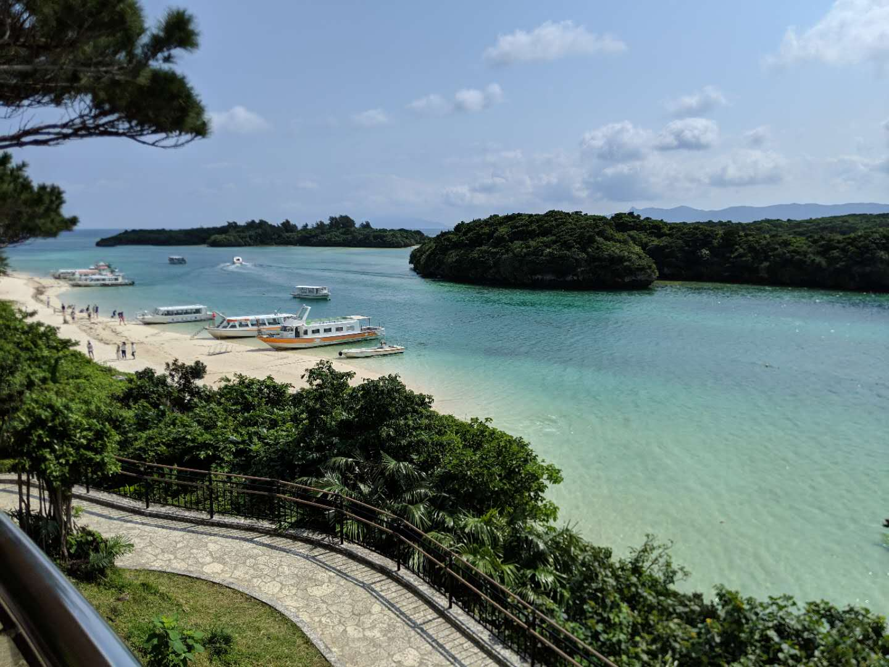
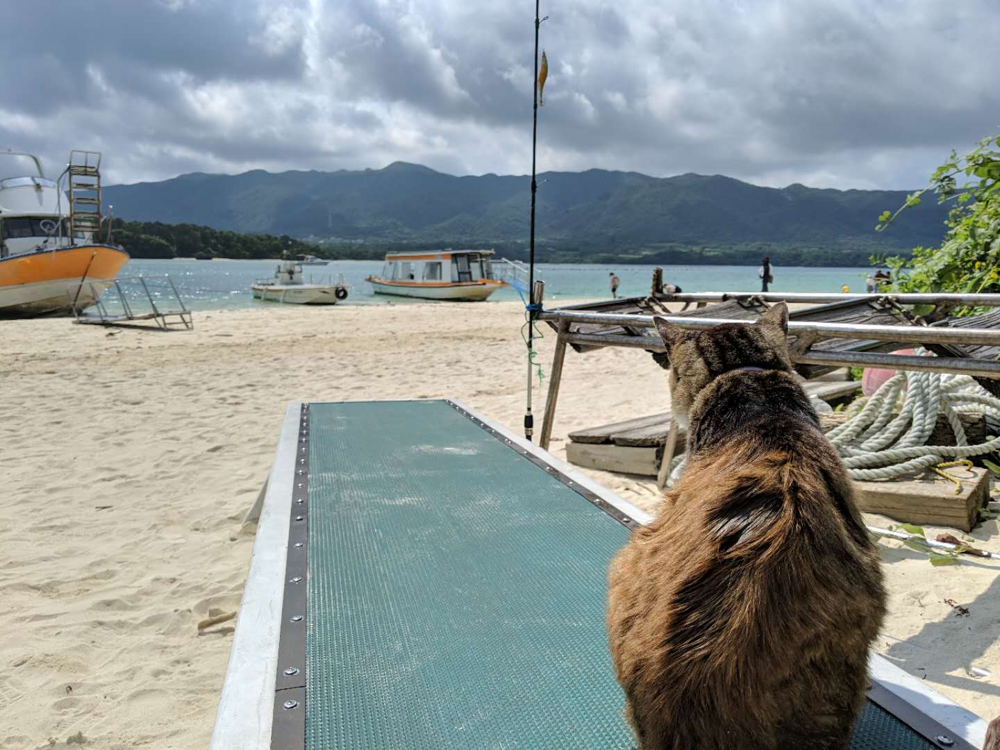
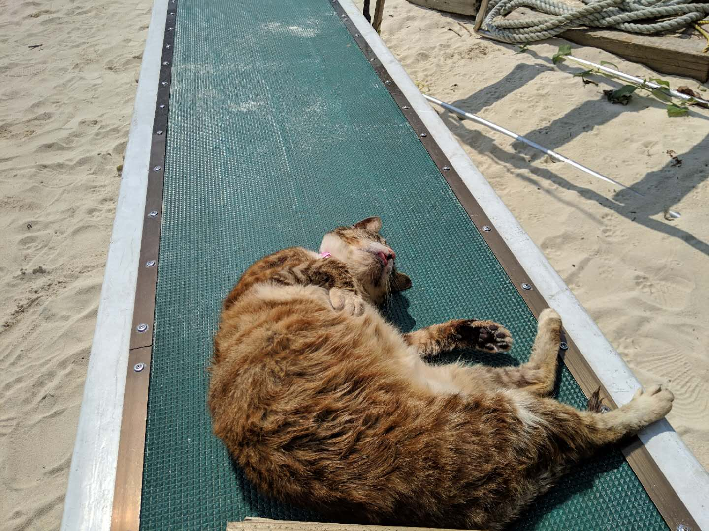
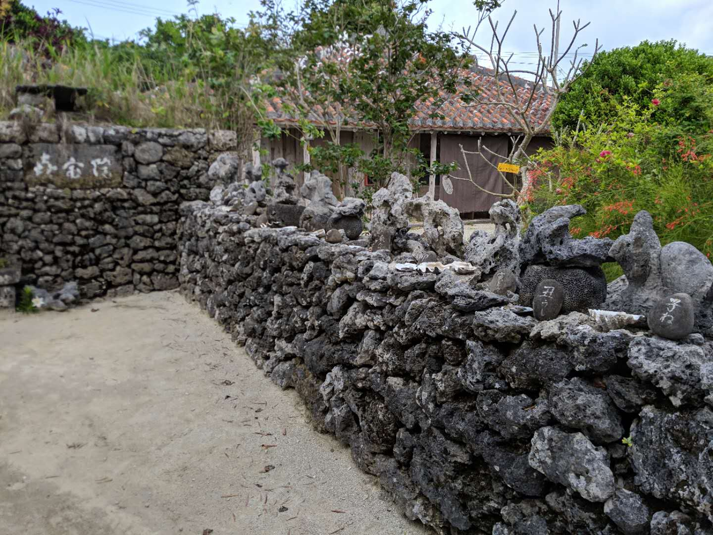
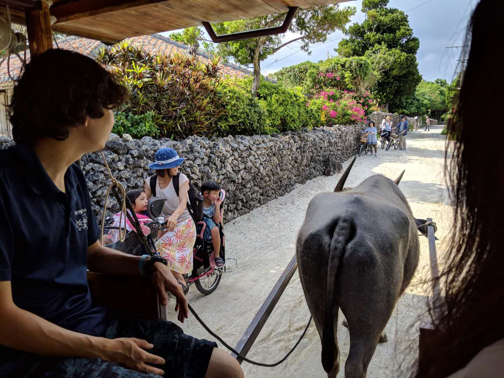
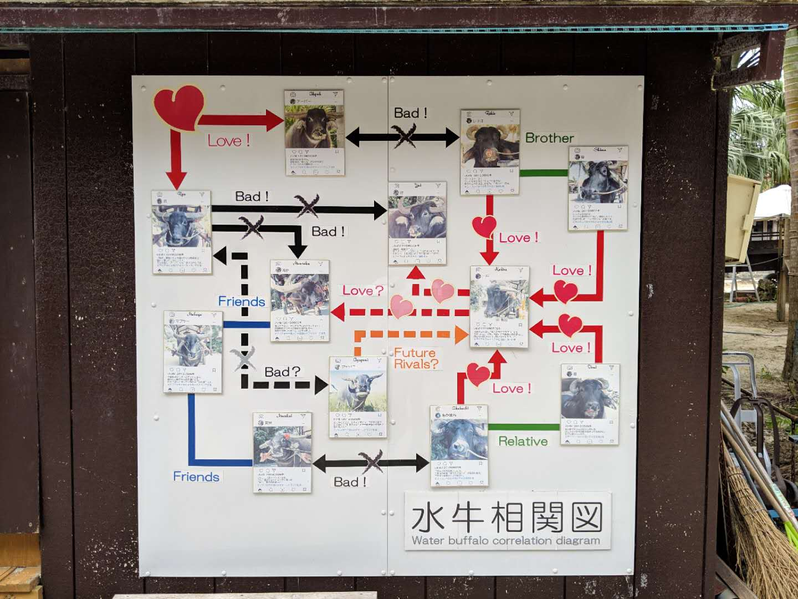
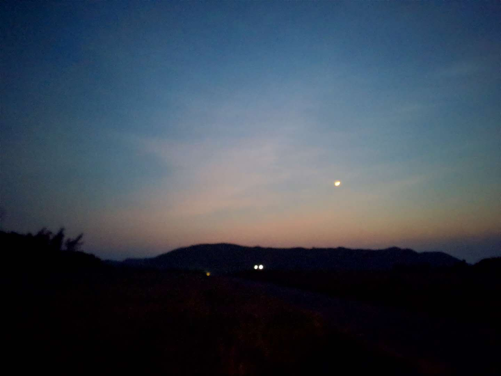
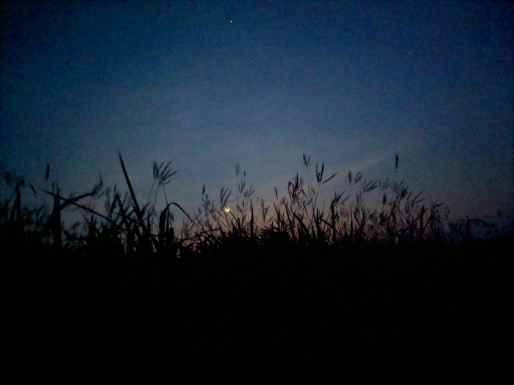

# day1
初到石垣大雨， 
河道泛滥， 
晴雨不定， 
被困公設市場， 
于小店听雨品茶,  
补全游记攻略数篇,  
不亦乐乎。

# day2 翡翠绿的大海
早上潜水教练小叔叔开着车来接人， 
满怀期待的上车后发现就只有我一人。 
这种活动不应该有很多可爱的小姐姐一起嘛？！ 

人少的好处是， 
可以有更多的私教时间。 
不知道是否是错觉， 
觉得健身后对于各种运动  
的适应性也增加了， 
但可以肯定的是， 
身材好后脱衣服更加自信了。 

石垣島周边的海比较浅， 
阳光照耀下呈现从美丽的翡翠绿， 
白沙形成的海底衬托着七彩的热带鱼， 
成片的珊瑚礁养育了富饶的生态系。 

下水后教练比我还兴奋， 
看我基本掌握节奏后就自顾自的拍鱼去了， 
让人一度怀疑到底谁是教练谁是来体验的。 

潜完第一个点后顺路去了人气的梦幻之岛， 
所谓的梦幻之岛， 
其实是退潮后露出水面的一片白沙滩， 
拍照的人多了，也就出了名。 
蓝天碧水白沙滩， 
确实是拍照的好地方。 

下午还有另外一组参加者， 
所以暂时开会了港口接人， 
顺便解决午餐， 
期待着有什么漁師料理,  
结果是ほっともっと的便当... ...  

扒着饭，想着下午说不定就有小姐姐了， 
然后看着教练拿出了3套潜水衣  
有两套还是女式的！  
就是，码好像有点大。 

随后一组退休大妈大爷  
迈着沉重的步伐渡上船， 

大爷的肚子好圆呐， 
看起来像是坏了三胞胎， 
大爷豪放的脱了个精光， 
开始痛苦的套上最大号的潜水衣， 
大妈一边嘲笑一边帮着大爷  
扯着潜衣的位置， 
虽然都已面目全非  
但依旧互相扶持的大爷大妈好有爱。 

下午换了一个点继续浮潜， 
教练说我已经可以出师了， 
毕竟带着三位老人已经耗光了他大半的精力， 
生活不易。  

大爷上船后一扭头， 
吐了一海， 
大妈一边和我们道歉一边拍着大爷的背， 
依旧很暖。 

想起一段话  
"认了天命之后， 
不再和自己较劲儿， 
天蓦然暗下来， 
所有道路和远方同时模糊， 
小肚腩立刻鼓起来， 
非常柔软， 
挡住了下面的阴茎。"  

诸君共勉  

还是年轻的时候多去使用肉体， 
多去狂喜与伤心  

# day3
对于没有租车的人来说， 
巴士tour基本是唯一的选择， 
巴士tour是否值得参加因人而异， 
可以的话， 
自己租一辆车慢慢玩会有更好的体验。 
石垣島的开发的景点并不多， 
往好处讲，这也保存了石垣島最原始自然的面貌。 

tour第一站是川平湾， 
米其林三星海景， 
话不多说看照片， 

由于前一天已经潜了一天的水， 
看了足够多的翡翠绿  
所以没有去参加玻璃船的漂流。 

沿着沙滩漫步，撸着猫， 
想这里的猫这是猫生赢家啊， 
有美景， 
有足够温暖的太阳晒， 
饿了下水抓鱼， 
渴了有村民喂水。 

按时间回到集合地点后发现迟迟等不到人， 
找了一圈人后小卖店的工作人员说车已经走了。 
一脸懵逼的和旅行公司协调后  
被告知车已经开去下个地点， 
原地等待派其它车来接应。 

虽然赶上了旅行团， 
但突然来这么一个事完全破坏了旅行的心情。 
后面的景点也觉得索然无味。 

开车下车拍照打卡， 
等着结束。  

## 竹富岛的水牛车
结束了巴士之旅后， 
直接来到港口买了最近的船票  
来到了竹富岛， 
竹富岛并不大， 
岛上的三个村落集群保存了  
红瓦屋的传统建筑特色， 
每一家的狮子石刻都各不相同。 

港口离村落10分钟路程， 
有免费的小车接送  
推荐岛上特色的水牛车， 
悠闲的绕集落一圈。 

这次拉我们的是11岁的公牛ryu， 
是这群水牛中最壮硕的， 
爱挑事打架经常被关黑屋。 
水牛有4岁小孩的智商， 
哪些地方难走， 
哪些地方有树荫可以休息都会记得清楚。 
所以全程耗时多久全凭水牛心情， 
有些牛知道是最后一班游客会跑的飞快赶着下班， 
有些牛会喜欢多上几次厕所来偷懒， 
大多数牛会在车夫拉三味线的时候偷懒， 
嗯，很人类一样一样的呢。 

不同水牛有不同的性格,  
弯角的欧洲牛爱不爱干活喜欢偷懒,  
直角的亚洲牛一般比较认真,  
看来地理决定论对于动物也适用呢。 

岛上的道路都是盐分浓度高的沙地  
所以不容易长野草， 
房屋周围的石墙也是用各种珊瑚化石堆积而成， 
这样台风经过的时候有足够的空隙可以排压。 
以及岛上还保留着原始的木制电线杆。 
虽然岛上生活不易， 
却处处充满了智慧与乐观。  
* 满目的花朵

## 石垣島的满天繁星
傍晚预约了星空向导， 
石垣島是有名的观星地， 
推荐[这家](httpt://www.utakuna-ishigakijima.com)  
岛上对于自然环境的保护也比较好。 
为了不对天空造成光污染,  
很多道路不设置路灯，只有反射板。 

搭上向导的小面包车， 
通行的一家人居然是石垣島本地居民， 
老奶奶女主人与三个小孩， 
女主人去年结束了东京的生活  
移住回了石垣島， 
这次带着三个小孩来体验故乡的自然， 
交谈中得知老奶奶年轻的时候也在东京工作过， 
经历过读书繁华的生活后  
最终还是选择回故乡生活。 

看着车外西下的夕阳不知不觉到了第一个地点， 
太阳刚下山，天还比较亮， 
所以向导先带我们到山脚的丛林里  
感受一下石垣島的自然， 
偶尔从头顶飞过的野鸟， 
在丛林中闪光的萤火虫。 
向导介绍了不同的野兽的叫声， 
才知道原来孔雀也会一起喵喵喵喵喵， 
据说石垣島的孔雀泛滥， 
当地人比较头疼， 
于是建议从中国抓两厨子来， 
说不定下次来孔雀肉就会成为新的特产。 

在山脚的丛林中听着鸟兽虫鸣， 
天色渐渐暗淡，星光逐渐璀璨， 
于是驱车开往下一个观星点。 

在一片田野间一行人下了车， 
向导铺好了草席， 
一行人席地而坐， 
或又仰卧望天， 
向导拿着激光笔给大家解说星座,  
比如如何通过北斗七星找到北极星， 
比如北极星在天空中的位置其实是固定的， 
而周围的星座围绕着北极星逆时针旋转。 

这时候如果响起"夜空中最亮的星"  
或者好妹妹的"一个人的北京"  
会瞬间热泪盈眶。  

"你有多久没有看到满天的繁星， 
城市夜里虚伪的光明遮住你的眼睛  
... ..."  

第三个观星点在海滩边， 
过往的道路没有任何灯光， 
月亮沉入海里后天上只有星空的光芒， 
在海风，浪花声，满天繁星下  
向导以一首三味线民谣结束了今天的观星之旅。 

# 其它文章
[其它游记](../menu.md)  
[点击查看ANA里程攻略](https://github.com/cheungYX/algorithm/blob/master/cheung/ana.md)  
[东京购房攻略](https://github.com/cheungYX/algorithm/blob/master/cheung/ff.md)  
[东京购房攻略2⃣️](https://github.com/cheungYX/algorithm/blob/master/cheung/ff2.md)  
[保险攻略](https://github.com/cheungYX/algorithm/blob/master/cheung/hokken.md)  
[职业规划篇](https://github.com/cheungYX/algorithm/blob/master/cheung/work_root.md)  