# 恒春古城
恒春大概是垦丁的玄关入口, 
去垦丁的必经之路, 
比起垦丁更加的淳朴, 
街上有很多美食, 
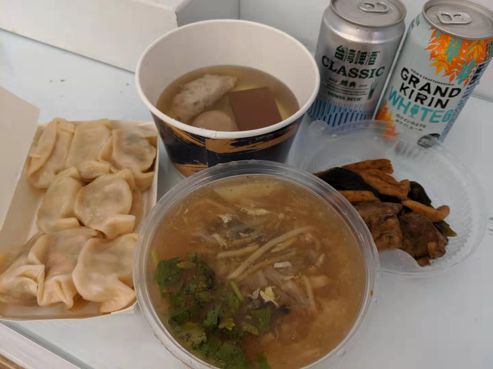
早上可以逛一逛菜市场, 
可以买一些热带水果和当地的古早味早餐, 
我们买了一颗大榴莲和芒果开始了新一天的旅程 
* 美食推荐
  - 恒春鹅肉店: https://goo.gl/maps/zEas456J75wGSSr18
  - 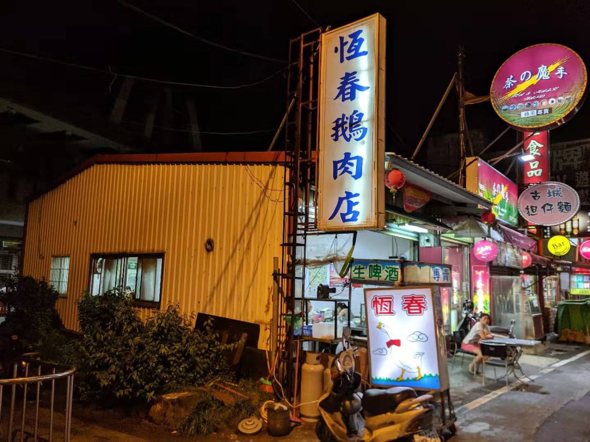
  - 老婆的私房菜: https://goo.gl/maps/ssMyBL3AaZVYf4GB7
  - 菜市場臭脯餅: https://goo.gl/maps/87bbT1gKs5NayRqo8
  - 旅南活海鮮: https://goo.gl/maps/NdzHzoz475wvD7Lc9
* 住宿推荐
  - Mira Bella Guest House
  - 一家白白净净的酒店,设计感好
  - 有一个可以玩ガチャ的灯塔
  - 斜对面就是海角七号的摄影地
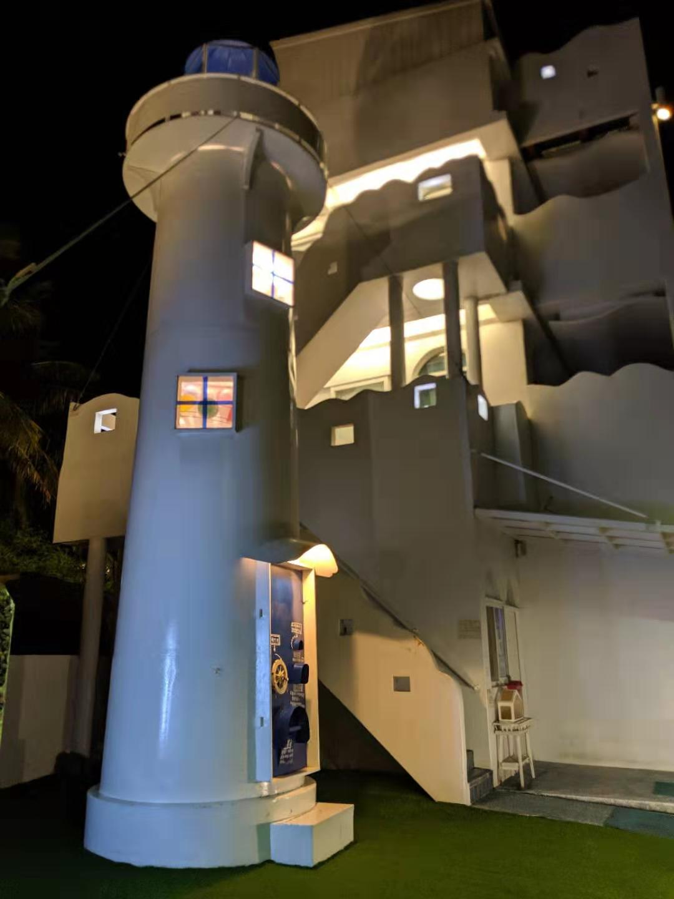

# 垦丁
由于时间不多, 
所以垦丁的行程我们安排了包车一日游, 
大约3000台币, 
司机兼导游是本地人,对于各个景点如数家珍, 
大概的景点和路线是, 
船帆石-砂島-鵝鑾鼻燈塔-南點-龍盤公園-後壁湖-貓鼻頭-白沙灣, 
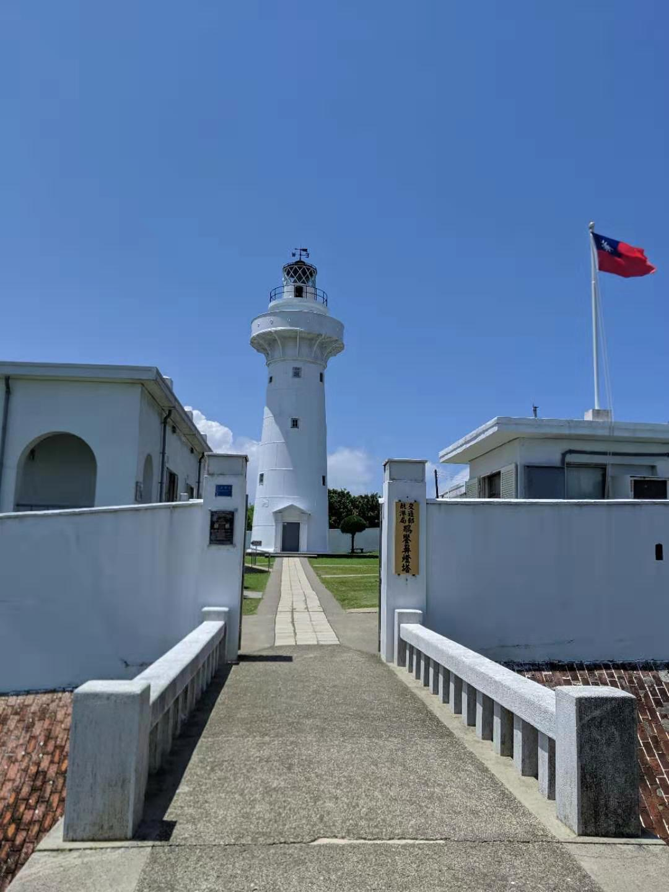

天很热游客很多,租车是正解, 
龍盤公園的海景印象比较深刻， 
其它景点有一些牵强, 
找一片海慢慢的呆着看着风轻云淡就好。 
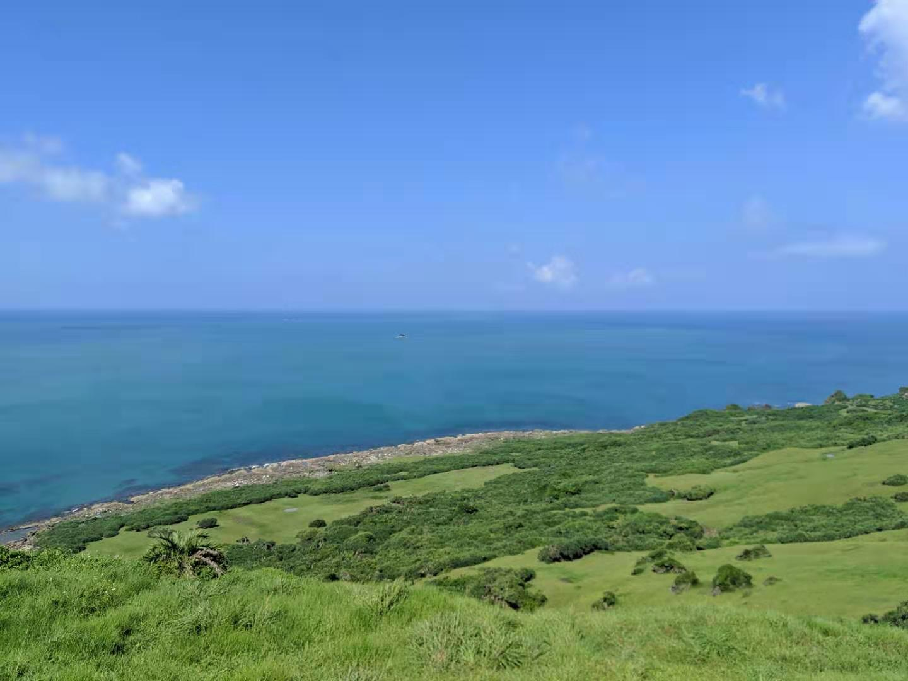

在佳乐水遇到了一个说年轻的时候去过日本的老伯， 
老伯说还是喜欢日本，就是现在上了年纪不好找工作， 
年轻时在日本的风俗店打工，闲暇时经常打钢珠， 
还非常热情的要传授给我打钢珠的技巧， 

民宿安排了沙岛边的海景房[放空間 Fun Space](http://uukt.com.tw/kenting/332/online-booking)， 
对面就是海滩, 
房间虽然小, 
但是窗台的景色很美, 
看着夕阳西下。 
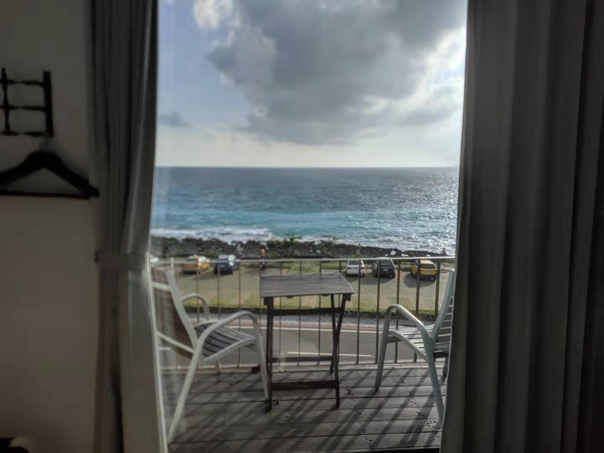

稍作休息后搭巴士前往了垦丁夜市, 
垦丁夜市应该是我见过的最热闹的夜市了, 
街的两边开满了各种网红店, 
游客多, 店的质量也参差不齐, 
不想踩坑的需要多做攻略。 
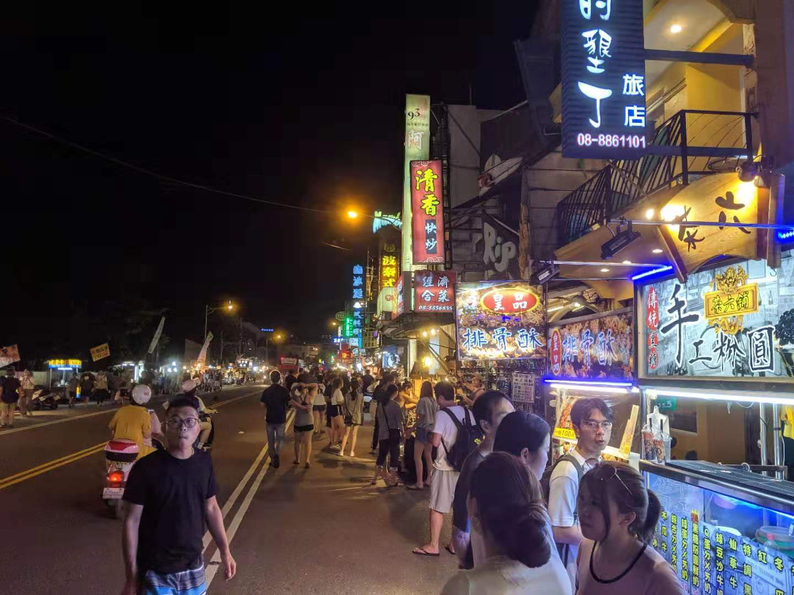

逛吃逛吃没多久就饱了, 
为了减轻罪恶感决定走路回民宿, 
这应该是目前为主旅游中走的最远的距离了吧, 
而且越走越黑, 
不过也由于黑，所以能看清天上的星空  

* 美食推荐
  - 波波窖烤Pizza
  - 勇伯熏茶鸭
  - 吴师傅一品卤味

# 小琉球
据说垦丁商业化比较严重,坑游客的多, 
朋友推荐了小琉球, 
可以从东港坐船前往, 
只需要30分钟, 
小琉球很小骑电瓶车环岛只需要40分钟, 
前往的路上发现船上确实是台湾本地人居多. 
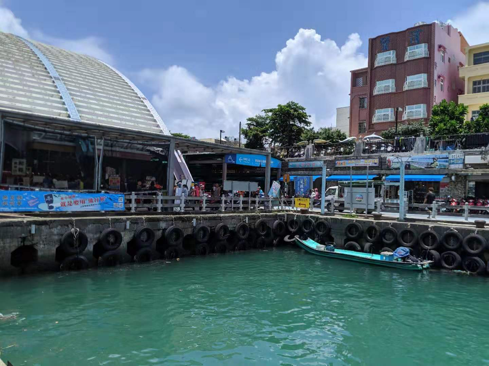

约了下午的岸潜, 
方便起见住宿也选择了潜店, 
小琉球有许多绿海龟, 
可惜这次没有见到, 
小琉球水很清, 
可以自己带着装备去浮潜, 

浮潜的地点在废弃的大渔港边, 
在潜店换好了湿衣, 
潜店的小卡车载着潜水器材和我开往了海边, 
路上忽然暴雨,打在身上发疼, 
机智的带上了潜镜, 

有点遗憾在海底没有看到小琉球的吉祥物绿海龟, 
不过海底还是很美, 
唯一的问题是岸边人太多, 
在上岸的过程中不知道被多少人给踢了 

小琉球的特色之一BBQ吃到饱, 
一人300多台币的自助海鲜BBQ, 
岛上有好几家店，都需要提前预约不然根本没位子。 
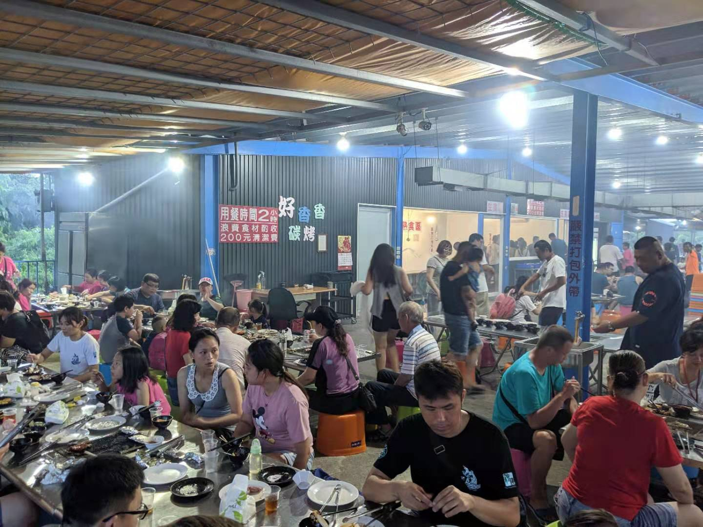

虾很鲜，品累也丰富, 
就是设施比较简陋, 
几个小时的烟熏可能对妹纸一脸贵重的化妆品有些糟蹋, 
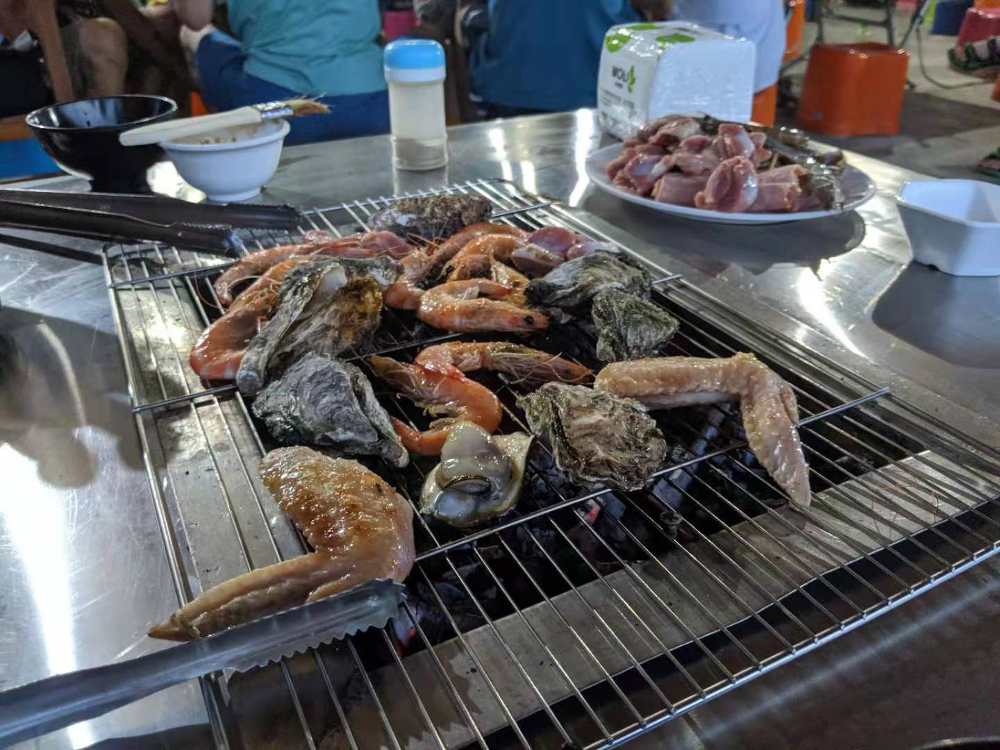

晚上可以逛一逛夜市, 
夜市美食也是不可错过的一部分, 
推荐美食如下 
* 美食
 - 古早味早午餐
 - 紐約客炸雞
 - 琉球糕, 香肠碗糕

# 东港高雄
次日中午, 乘船返回了东港, 
东港是台湾有名的渔港, 
所以有很多海鲜店, 
推荐路过一定要来吃一下, 
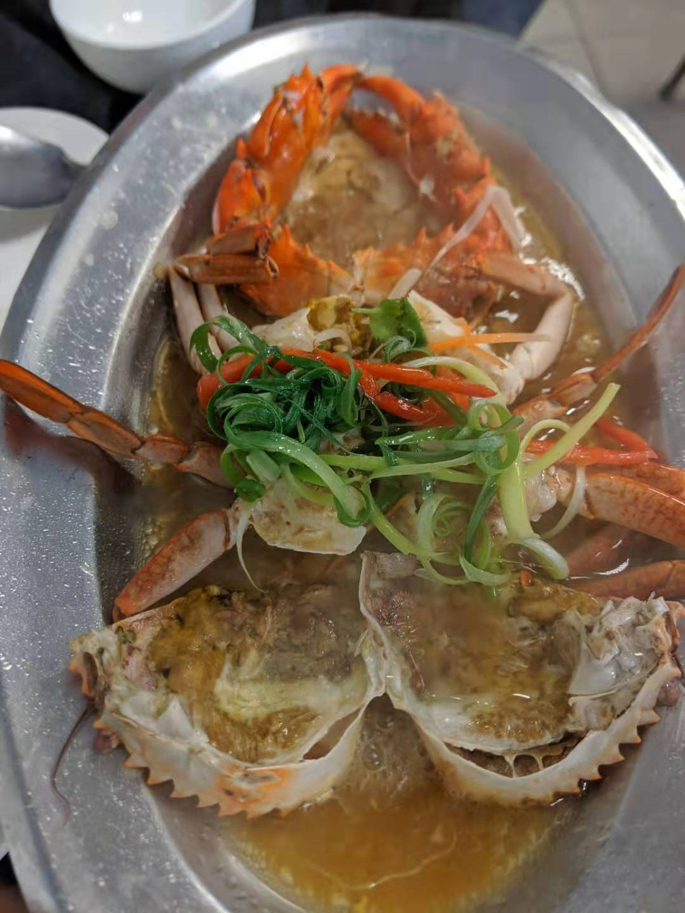

包车前往了高雄的住处, 
艳阳高照，在酒店等太阳下山后才敢出门, 

司机大哥一路上都在推荐幸福堂的奶茶, 
所以特地去了新堀江商圏, 
堀江商圏除了美食还有不少店铺, 
有兴趣的同学可以淘一淘 
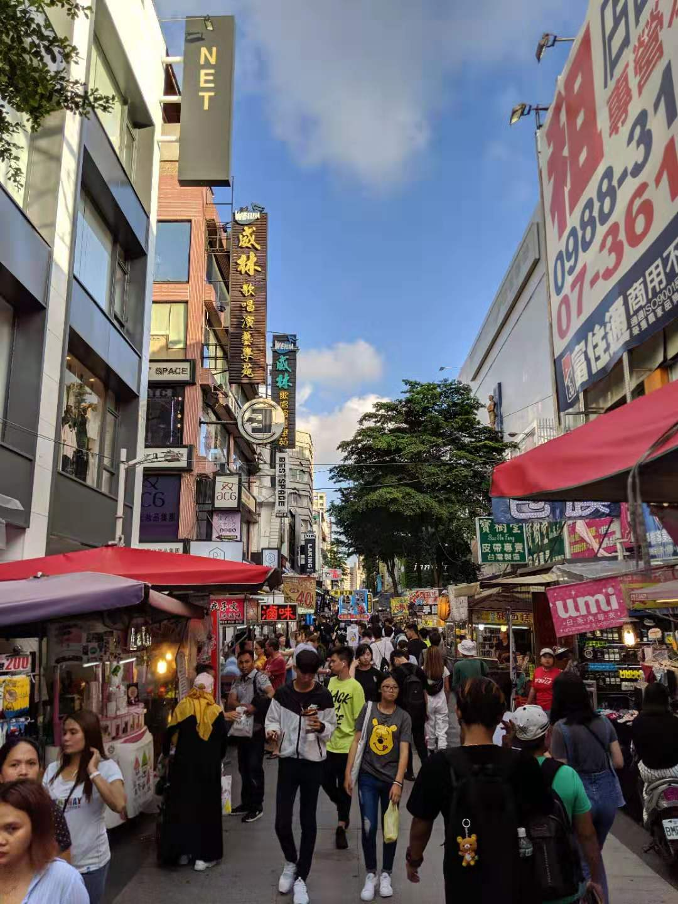

夜晚去了六合夜市, 
比起垦丁的夜市六合夜市人要少多了, 
不多废话,放图 
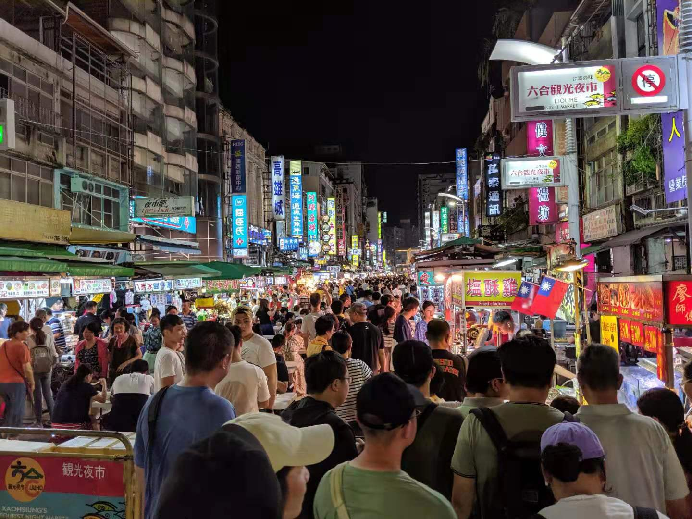

回酒店后约了第二天到机场的出租, 
垦丁玩的比较匆忙,意犹未尽, 
潜水也没尽兴, 
期待着下次来能有多一些时间, 
能去绿岛和蘭嶼逛一逛. 
