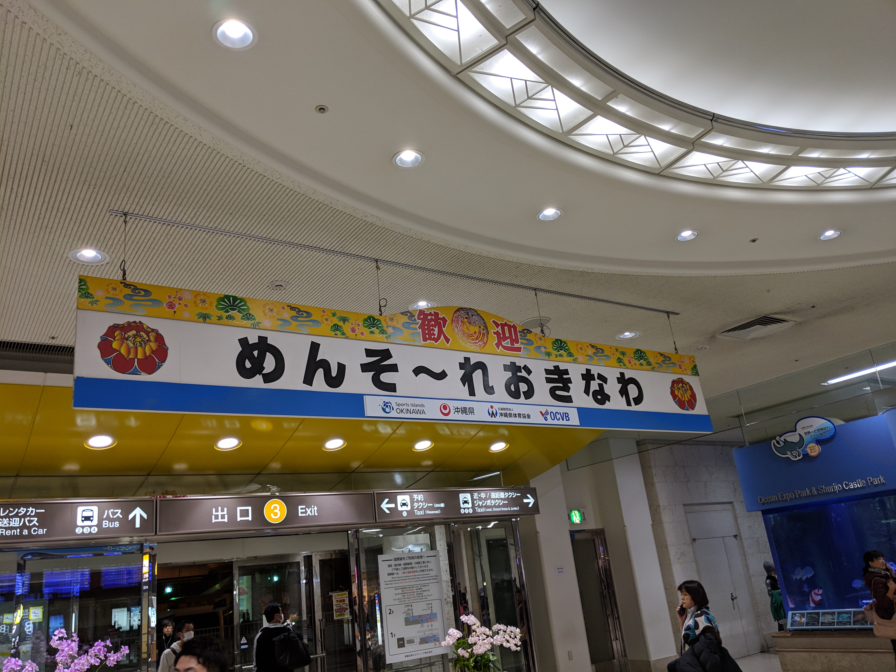
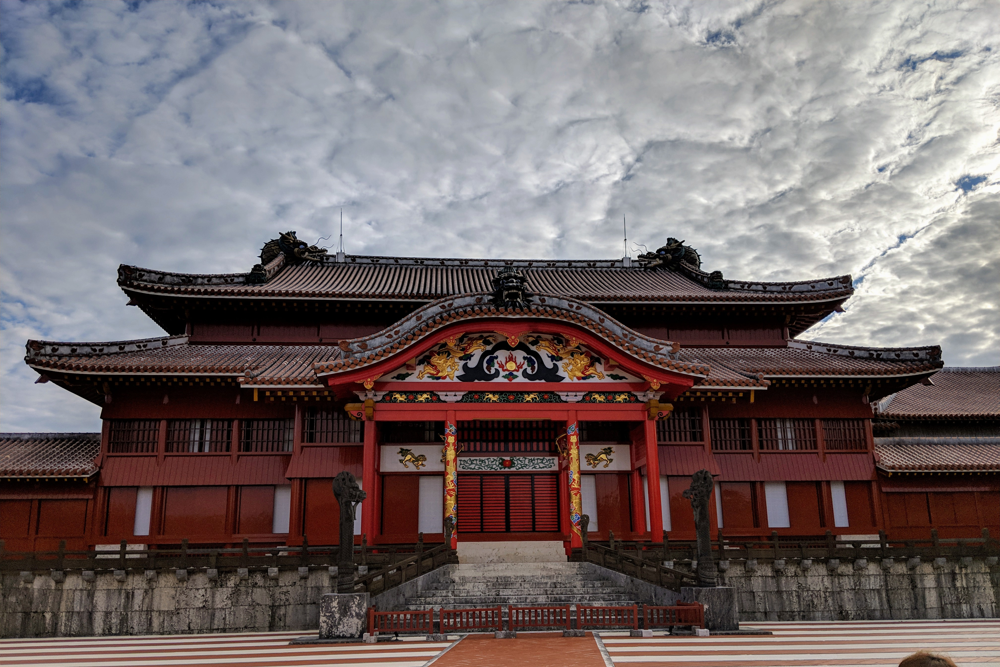
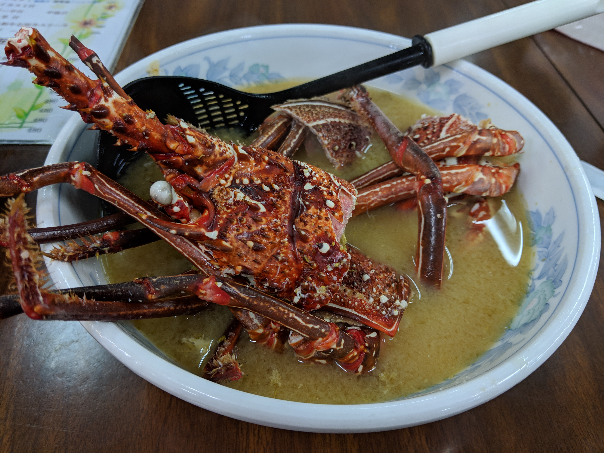
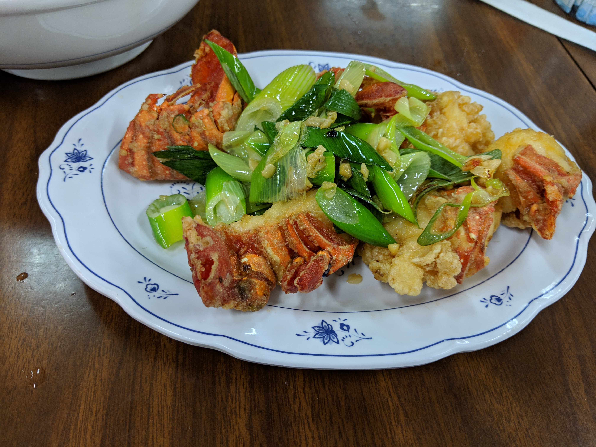
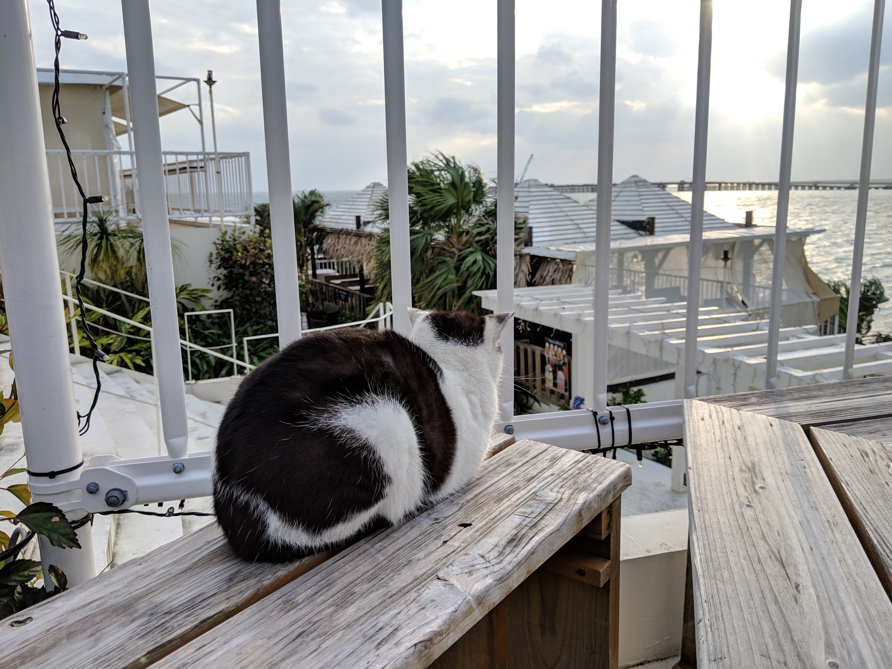

# 周末去旅行吧
自从换了一家制度灵活公司后， 
加班日减，能自由掌控的时间更多了， 
正好今年也打算刷SFC， 
于是特意留意的提前75天预定的ANA低价机票， 
周五早上出发，周一上午回来， 
配合公司的happy Monday制度正好周末能来个弹丸旅游。 

# 南国风光
飞机落地冲绳后的第一个感受是这里的风真温暖啊， 
和东京只有个位数的气温相比， 
冲绳只需要穿一件T恤就能出门浪了。 

酒店checkin后放下行李就匆匆出门了， 
原本网上查了几家有特色的料理打算尝试， 
无奈没预约都满人了， 
有去的小伙伴记得要预约 

沿着国际通没目的地的一路逛， 
沿途都是游客，韩国和中国为主， 
从化妆和服饰还是很好分的， 
国际通的两边也都是以招揽游客为主的各种小店， 

不需要买礼物的朋友不推荐久留，走马观花即可， 
也不推荐在这附近吃饭，价格多偏贵， 
对于吃惯日料的在日华人肯定也不会满意。 

绕路找了一个看起来本地人多的居酒屋， 
点了海鲜和泡盛(冲绳本地酒)， 
一边独酌一边查攻略考虑第二天的行程。 

[沖縄料理 泡盛 琉歌 沖縄本店](https://maps.app.goo.gl/T4kmL)

# 首里城的琉球王朝
睡到自然醒后，坐电车直奔首里城， 
推荐买一张one day pass, 
路上没看到什么人，就在以为要承包了整座首里城的时候， 
见到了停车场里走出的一队队旅游团， 

首里城原为琉球万国尚氏王朝所建的王宫， 
由于物理上更加接近，且与中原王朝有紧密的交流， 
建筑中能看到很多中国文化的影响， 

第二次世界大战的时候， 
由于帝国陆军把指挥部设置在了城下而成为美军攻击的目标， 
在重舰的炮火中付之一炬可怜焦土。 

现在的首里城都是近现代复原重建的， 
且重建工程也还处在现在进行时， 
正殿外围的建筑群都还没完工， 
虽然被认定为世界遗产， 
但其主体其实是琉球王国的城堡以及相关遗产群， 
也就是说我们看到的复原建筑物并不是世界遗产， 
世界遗产是重建正殿地下的遗迹， 
在正殿一楼有一个透明钢化玻璃， 
可以看到正殿地下的遗迹。 

虽然琉球的战斗力很渣， 
但是文化输出能力一流， 
首里城每年都会举行很多宣传琉球传统文化的活动， 
比如下面这个， 
[首里城祭「琉球王朝絵巻行列」](http://oki-park.jp/shurijo/information/detail/4111) 
有兴趣的小伙伴可以报名参加， 
如果气质合适还能当选下一届的琉球国王， 
任期一年呢。 

# 县立博物馆与海鲜市场的龙虾

雨过天晴，打算解决温饱问题， 
于是去了念念不忘的[第一牧志公设市场](https://maps.app.goo.gl/RJrrf)(点击可进入谷歌地图)， 
一楼海鲜市场买的新鲜食材, 
只需要给500日元的加工费就可以直接拿到二楼料理, 

挑了一只龙虾满意的上楼， 
老板推荐虾身子爆炒葱花，虾头做成味噌汤， 
原本计划着半小时后去下一个景点， 
没想到足足啃了一个多小时的龙虾， 
身边的客人都换了好几轮， 
于是不好意思的又点了一碗面，彻底的吃撑了。 

# 濑长岛的虚度时光
由于没有租车，公共交通所能去的景点不多， 
问了一下小伙伴，推荐了[瀬長島 ウミカジテラス](https://maps.app.goo.gl/aC67W), 
这个机场旁填海建的小岛， 
喜欢飞机的小伙伴，这里有很好的拍照point， 
可以近距离看着飞机从头顶飞入跑道。 

岛上有个温泉酒店， 
岛的另一面，阶梯式的建了许多文艺的小店， 
吹着海风看着阳光洒在海面上， 
岛上还有很多猫， 
慵懒着享受着最好的阳光。 

" 生活应该像它们一样美好， 
  一样无意义，像被虚度的电影 
  连落日一起浪费，一直消磨到星光满天 " 

[二刷冲绳]()

# 其它文章
[其它游记WIP](../menu.md)  
[点击查看ANA里程攻略](https://github.com/cheungYX/algorithm/blob/master/cheung/ana.md)  
[东京购房攻略](https://github.com/cheungYX/algorithm/blob/master/cheung/ff.md)  
[保险攻略](https://github.com/cheungYX/algorithm/blob/master/cheung/hokken.md)  
[职业规划篇](https://github.com/cheungYX/algorithm/blob/master/cheung/work_root.md)  

